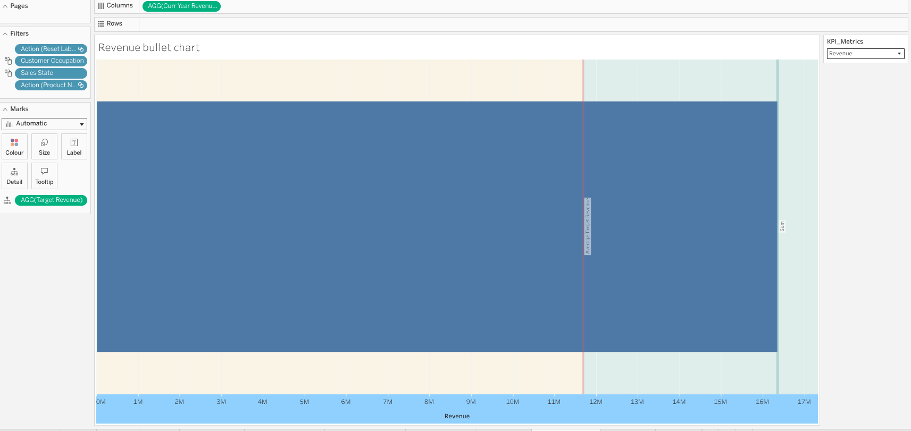
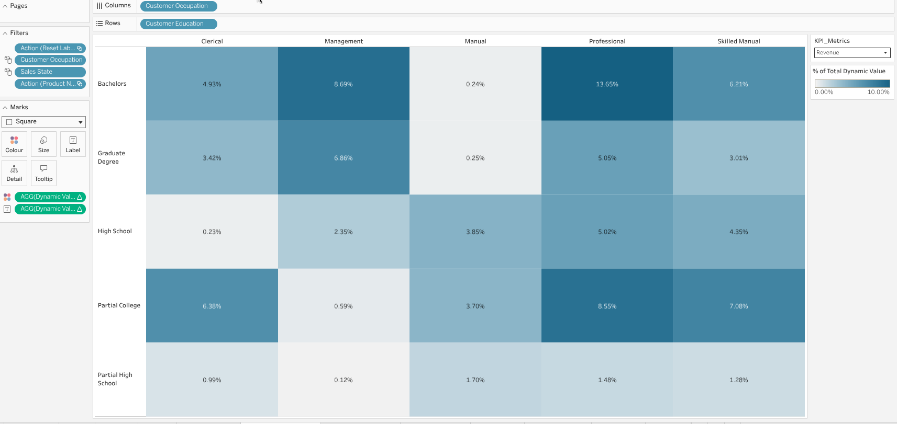
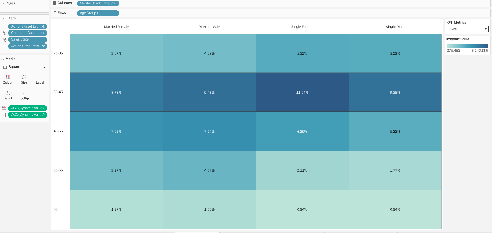
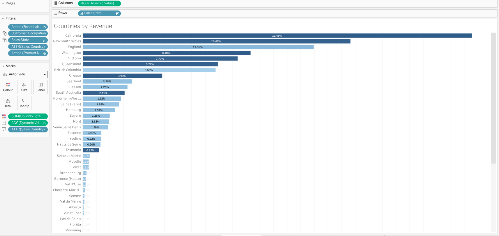
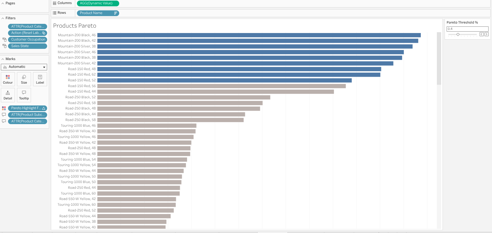
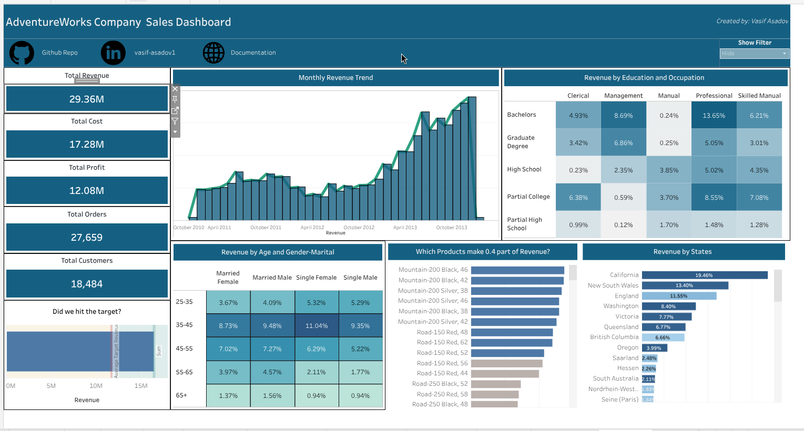
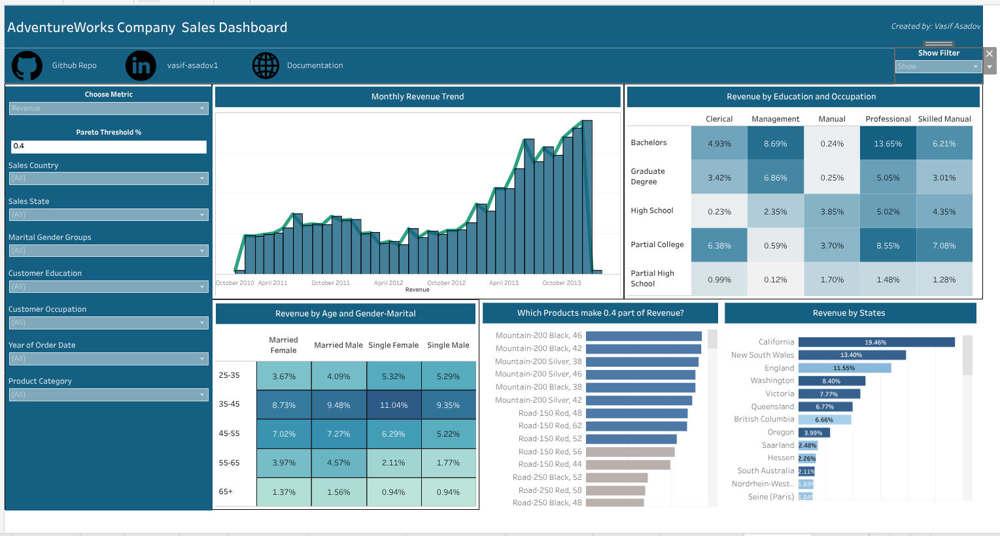

## Introduction 

Solving business questions with SQL queries is a powerful way to gain insights and make informed decisions. However, tabular results are mainly for the analysts and may not be easily digestible for executives or stakeholders who have limited time and want to quickly understand the key takeaways. To address this, as a data analyst we should always build an executive dashboard that summarizes the key insights from our analysis in a visually appealing and easy-to-understand format. This dashboard will include charts, graphs, key performance indicators (KPIs) and concise summaries that highlight the most important findings from our analysis. By doing so, we can effectively communicate our insights to not only the analysts but also to the executives and stakeholders, enabling them to make informed decisions based on the data. 

Since the dashboard will be used by executives, it is crucial to be concise and focus on the most impactful insights that can drive business decisions. We should prioritize the key findings that have the greatest potential to influence strategic initiatives. Additionally, we should use clear and simple visualizations without overloading the dashboard with too much and complex information. Some people may think that colorful and flashy dashboards are more engaging, but in reality, a clean and minimalist design is often more effective in conveying the message and allowing the executives to quickly focus on the key insights rather than getting distracted by unnecessary elements and themes. Therefore, we should aim for a balance between visual appeal and clarity, ensuring that the dashboard is both informative and easy to understand for our executive audience. By doing so, we can maximize the impact of our analysis and facilitate data-driven decision-making at the executive level.


## Selecting Dashboard Tool

When it comes to selecting a dashboard tool for our executive dashboard, there are several options available in the market, each with its own strengths and weaknesses. Some popular dashboard tools include Tableau, Power BI, Looker, and Google Data Studio. As a data analyst, I am experienced mainly with Tableau and Power BI, which are both powerful and widely used tools for creating interactive and visually appealing dashboards. Tableau is known for its user-friendly interface and robust data visualization capabilities, making it a great choice for creating complex and dynamic dashboards. Power BI, on the other hand, is tightly integrated with Microsoft products and offers strong data modeling and reporting features, making it a good option for organizations that are already using the Microsoft ecosystem. Ultimately, the choice of dashboard tool will depend on factors such as the specific requirements of the dashboard, the existing technology stack of the organization, and the preferences of the stakeholders. 

Besides the drag-and-drop BI tools, there are also other options for creating dashboards, such as using programming languages like Python or R with libraries like Dash or Shiny. These options can provide more flexibility and customization but require more technical expertise and coding skills. Therefore, as a data analyst, if you have limited time and want to quickly create a dashboard, using a BI tool is often the most efficient and effective choice. However, if you have enough domain knowledge and technical understanding, you can build quite highly customized dashboards even with the Microsoft Excel and Google Sheets, which are widely accessible and familiar to many users. Ultimately, the key is to choose a tool that allows you to effectively communicate your insights and meet the needs of your executive audience while also considering your own skills and resources as a data analyst.

In this project I will use Tableau as a BI tool to build my executive dashboard, as I have experience with it and it offers a wide range of features for creating interactive and visually appealing dashboards. 


## Data for Dashboard

In order to create an effective executive dashboard, we have two options for the data we can use: 

1. **Using original data:** We can use the original data which is multi-table in our case and require creating lots of calculated fields and paramaters in Tableau. We should also connect / join these tables in Tableau and then create the dashboard in order to make the filters applicable. This approach is not preferred in large-scale projects as it will definitely cause performance issues and slow down the dashboard, especially if the data is large and complex. Each time we apply a filter, Tableau will have to query the data source and perform calculations on the fly, which can lead to long loading times and a poor user experience for the executives who are using the dashboard.
2. **Using aggregated data:** We can create an aggregated table in SQL that contains all the necessary metrics and dimensions for our dashboard. This approach is more efficient and will significantly improve the performance of the dashboard, as Tableau will be querying a pre-aggregated dataset rather than performing calculations on the fly. By using an aggregated table, we can ensure that the dashboard loads quickly and provides a smooth user experience for the executives who are using it. We can create this aggregated tables by writing SQL queries and then restoring them as views in our database. Then we can connect Tableau to our SQL database and use these views as the data source for our dashboard. This way, we can leverage the power of SQL for data transformation and aggregation while still benefiting from the interactive and visual capabilities of Tableau for our executive dashboard. In that case, all heavy calculations and groupings will be applied in SQL and making the Tableau free from heavy calculations and improving the performance of the dashboard significantly.

I created a single aggregated table in SQL that contains all the necessary metrics and dimensions for our executive dashboard. I prepared my data at the order line level in which each row represents a single order line item, and includes dimensions such as Order Date, Ship Date, Country, Product Category, and measures such as Sales Amount, Profit Margin, Freight Cost, Tax Amount, etc. I joined all dimension tables to the fact table at the order line level and then performed all necessary calculations and aggregations in SQL to create a comprehensive dataset that can be easily used in Tableau for building the executive dashboard. These types of aggregated tables are often referred to as 360-degree views or data marts, as they provide a holistic view of the data and allow for efficient analysis and reporting in BI tools like Tableau. By using this approach, we can ensure that our executive dashboard is both performant and provides the necessary insights for informed decision-making at the executive level. Following SQL query is used to create the aggregated table for our executive dashboard:

<details>
<summary>SQL Query for Creating Aggregated Table</summary>

```sql
create or alter view orderline_level_agg as 
with get_last_date as (
	select 
		max(orderdate) as reference_day
	from FactInternetSales
)
select
	fis.SalesOrderNumber as order_number,
	fis.SalesOrderLineNumber as order_line_number,

	-- product info
	fis.ProductKey as product_key,
	pr.ProductName as product_name,
	sub.ProductSubcategoryName as product_subcategory,
	cat.ProductCategoryName as product_category,
	pr.ListPrice as product_list_price,
	
	-- customer info
	cus.customerkey as customer_key,
	concat(cus.FirstName, ' ', cus.LastName) as customer_name,
	DATEDIFF(year, cus.BirthDate, gld.reference_day) as customer_age,
	cus.Gender as customer_gender,
	cus.MaritalStatus as customer_marital_status,
	cus.Education as customer_education,
	cus.Occupation as customer_occupation,
	cus.YearlyIncome as customer_income,

	-- regional sales info
	st.SalesTerritoryGroup as sales_territory_group,
	st.SalesTerritoryCountry as sales_country,
	st.SalesTerritoryRegion as sales_region,
	geo.StateProvinceName as sales_state,
	geo.City as sales_city,
	geo.PostalCode as sales_postal_code,
	geo.IpAddressLocator as sales_ip_address,

	-- financial data
	cast(fis.SalesAmount as decimal(20,3)) as revenue,
	cast(fis.TotalProductCost as decimal(20,3)) as cost,
	cast(fis.SalesAmount - fis.TotalProductCost as decimal(20,3)) as profit,
	cast(fis.TaxAmt as decimal(20,3)) as tax,
	cast(fis.Freight as decimal(20,3)) as freight,
	cast(fis.UnitPrice as decimal(20,4)) as unit_price,
	fis.OrderQuantity as quantity,
	cur.CurrencyName as currency, 

	-- time data
	fis.OrderDate as order_date,
	fis.ShipDate as ship_date,
	fis.DueDate as due_date

from FactInternetSales fis
left join Customer cus 
	on cus.CustomerKey = fis.CustomerKey
left join geography geo
    on geo.geographykey = cus.geographykey
left join SalesTerritory st
	on st.SalesTerritoryKey = fis.SalesTerritoryKey
left join Products pr
	on pr.ProductKey = fis.ProductKey
left join ProductSubcategory sub
	on sub.ProductSubcategoryKey = pr.ProductSubcategoryKey
left join ProductCategory cat
	on cat.ProductCategoryKey = sub.ProductCategoryKey
left join Currency cur
	on cur.CurrencyKey = fis.CurrencyKey
left join Calendar cal 
	on cal.DateKey = fis.OrderDateKey
cross join get_last_date gld;
```

</details>

I have taken the last date from the data as a reference day to calculate the customer age, which is a common practice in data analysis when we want to calculate age based on a specific point in time. By using the last date from the data as the reference day, we can ensure that our age calculations are consistent and accurate based on the most recent information available in the dataset. This approach allows us to have a clear understanding of the age distribution of our customers at the time of their last purchase, which can provide valuable insights for marketing and customer segmentation strategies.

## Building the Dashboard

Before building the dashboard, we should firstly define the key metrics and dimensions that we want to include in our executive dashboard. These should be aligned with the business questions we want to answer and the insights we want to communicate to the executives. Then for each question - task we will dedicate one sheet in Tableau and create the necessary visualizations and calculations to answer that specific question. In my dashboard, I have included the following key metrics and dimensions:

1. **Total Revenue:** This metric represents the total sales revenue generated from our B2C operations. It is a key indicator of our overall business performance and growth.
2. **Total Customers:** This metric represents the total number of unique customers who have made purchases in our B2C operations. It provides insights into our customer base and market reach.
3. **Total Cost:** This metric represents the total cost incurred in our B2C operations, including product costs, freight costs, and tax amounts. It helps us understand our cost structure and profitability.
4. **Total Orders:** This metric defines the number of unique orders placed.
5. **Total Profit:** The difference between total revenue and total cost, which indicates the overall profitability of our sales operations.

The above metrics are called Key Performance Indicators (KPIs) in finance and business analysis, as they provide a quick snapshot of the overall performance and health of our B2C operations. These KPIs are essential for executives to monitor and evaluate the success of our business strategies and make informed decisions based on the data. By including these KPIs in our executive dashboard, we can effectively communicate the key insights and trends in our sales performance to the executives and stakeholders, enabling them to take appropriate actions to drive business growth and profitability.

In the other visualizations, I always showed / compared these metrics since our focus are these KPIs. To make the dashboard dynamic and interactive, I created a parameter in Tableau which allows the user/executive to select the specific KPI they want to focus on, and then all the visualizations below will be updated accordingly to show the selected KPI. This way, we will have a single compact and clean dashboard that can provide insights on all the key metrics without overwhelming the user with too many visualizations at once. The user can simply select the KPI they are interested in and the dashboard will update to show the relevant insights for that specific metric. This approach allows us to effectively communicate the key insights and trends in our sales performance while keeping the dashboard concise and easy to understand for our executive audience.

6. **Revenue by Months-Years:** This is a time series visualization that shows the trend of revenue over time, broken down by months and years. It helps us identify seasonal patterns, growth trends, and any fluctuations in our sales performance over time.




7. **Education and Occupation Segmentation:** This is a heatmap visualization that shows the distribution of KPIs based on their education and occupation. It helps us understand the demographics of our customer base and identify any patterns or trends in their purchasing behavior based on their education and occupation.



8. **Age and Marital-Gender Segmentation:** This is a heatmap that shows segmentation of KPIs based on age and marital status and gender. For making the dashboard more compact, I combined the marital status and  gender dimensions into a single dimension in Tableau, which allows us to show the segmentation of KPIs based on both age and marital-gender in a single visualization. This created a groups - "married male", "married female", "single male", "single female" groups and these groups together with age groups created a heatmap that shows the distribution of KPIs.



9. **Countries by Revenue:** This is a bar chart that shows the revenue generated from different countries. It helps us identify which countries are driving the most revenue and allows us to compare the performance of our sales across different regions.




10. **Products Pareto Analysis:** This is a Pareto chart that shows the cumulative contribution of different products to our total revenue. Pareto Analysis is a technique used to identify the most important factors that contribute to a particular outcome. For example, in our case, we can use Pareto Analysis to identify the top products that contribute to the 80% of our total revenue. For interactivity, I created a parameter that defines the pareto threshold, which allows the user to select the percentage threshold (e.g., 80%) and the chart will update accordingly to show the products that contribute to that percentage of total revenue. If the person select 0.8 as the threshold, the chart will show the products that contribute to 80% of total revenue, and if they select 0.9, it will show the products that contribute to 90% of total revenue, and so on. This way, we can easily identify the most important products that are driving our sales performance and focus our efforts on optimizing those products for maximum impact.




11. **Revenue Bullet Chart:** Bullet chart is a simplier alternative to gauges and meters, which are often used in executive dashboards to show progress towards a target or goal. In our case, we can use a bullet chart to show our revenue performance against a target revenue. The bullet chart consists of a horizontal bar that represents our actual revenue, and a vertical line that represents the target revenue. The color of the bar can indicate whether we are below, at, or above the target. For example, if the bar is red, it indicates that we are below the target; if it is yellow, it indicates that we are at the target; and if it is green, it indicates that we are above the target. This visualization allows executives to quickly assess our revenue performance and understand how close we are to achieving our revenue goals.


## Dashboard

The first and main part was creating these sheets - visualizations in Tableau. However, it does not end here since we should arrange these visualizations in a dashboard format and make it visually appealing and easy to understand for the executives. We should also add titles, labels, and concise summaries to each visualization to provide context and highlight the key insights. Additionally, we should ensure that the dashboard is organized in a logical flow, with the most important KPIs and insights placed prominently at the top or center of the dashboard. 

To effectively arrange the visuals I used horizontal and vertical containers together with blank objects in Tableau to create a clean and organized layout for the dashboard. I also used consistent colors, fonts, and formatting across all visualizations to create a cohesive and professional look. By using these design principles, we can create an executive dashboard that is not only visually appealing but also effectively communicates the key insights and trends in our sales performance to the executives and stakeholders, enabling them to make informed decisions based on the data.

I also added some buttons which directs the users - executives to the Github Repository of this project, where they can find the SQL code and the data preparation steps that I have done for this analysis. This way, we can provide transparency and allow the executives to explore the underlying data and code if they are interested in understanding the details of our analysis. By including these buttons, we can enhance the interactivity of the dashboard and provide additional resources for executives who want to dive deeper into the data and analysis behind the insights presented in the dashboard.

I also added a "Show filter" button which activates a sidebar containing all the filters and parameter selections for the dashboard. Putting these filters and parameters inside the dashboard would lead to a very cluttered and overwhelming dashboard, especially for executives who have limited time and want to quickly understand the key insights. By placing these filters and parameters in an interactive sidebar that can be toggled on and off with a button, we can keep the main dashboard clean and focused on the key insights, while still providing the option for executives to explore the data further if they choose to do so. This approach allows us to strike a balance between providing interactivity and maintaining a clear and concise dashboard that effectively communicates the key insights to our executive audience.






## Conclusion

Till here we have built an executive dashboard that summarizes the key insights from our analysis in a visually appealing and easy-to-understand format. The dashboard includes charts, graphs, key performance indicators (KPIs) and concise summaries that highlight the most important findings from our analysis. I organized the visuals in a logical flow, with consistent blue themed colours that will not create eye strain for the executives, and used horizontal and vertical containers together with blank objects in Tableau to create a clean and organized layout for the dashboard. I also added buttons that direct the users to the Github Repository of this project, where they can find the SQL code and the data preparation steps that I have done for this analysis, providing transparency and allowing the executives to explore the underlying data and code if they are interested in understanding the details of our analysis. Additionally, I added a "Show filter" button which activates a sidebar containing all the filters and parameter selections for the dashboard, allowing us to keep the main dashboard clean and focused on the key insights while still providing interactivity for executives who want to explore the data further. Overall, this executive dashboard effectively communicates the key insights and trends in our sales performance to the executives and stakeholders, enabling them to make informed decisions based on the data.

We can further develop this dashboard by adding more dashboards which explain product domain, spatial domain and customer domain insights deeply. However, as this is an overall executive dashboard, I focused on the most important and impactful insights that can drive business decisions, and kept the dashboard concise and easy to understand for our executive audience. By doing so, we can maximize the impact of our analysis and facilitate data-driven decision-making at the executive level.

You can reach out the Interactive Tableau Dashboard here: 
[AdventureWorks Bike Sales Executive Dashboard](https://public.tableau.com/authoring/AdventureWorksExecutiveDashboard_17723260919680/Dashboard2#1)


