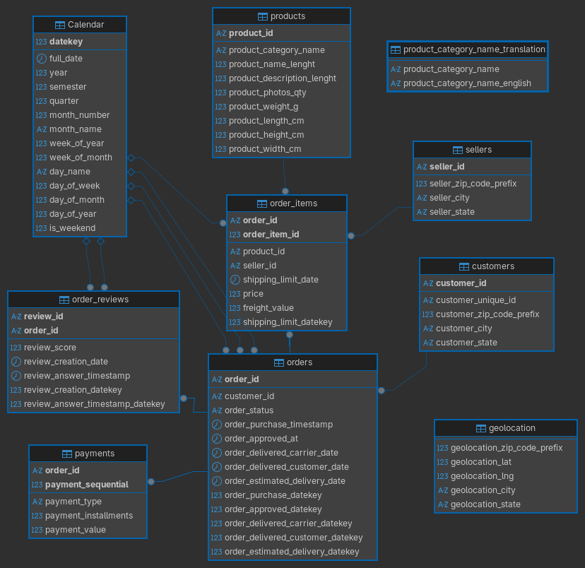

##  Data Ingestion 

The first step in our analysis process is to import the data into our analysis environment. We will be using SQL Server as our database management system, and we will import the data from the provided CSV files into a new database called `Olist-E-Commerce`. We can create the database and import data both using SQL scripts and graphical user interface (GUI) tools. I am using DBeaver as my SQL client, which provides a user-friendly interface for managing databases and importing data. For simpllicity, I will use Dbeaver GUI to create database and import the csv files into the database. 

##  Create Database 

- After connecting to the SQL Server instance using DBeaver, right click on the 'master' database and select 'Create New Database'. Name the database `Olist-E-Commerce` and click 'OK' to create the database. 
- Click to *Refresh* the database list to see the newly created database. 

###  Import Data 

- Right click on the `Olist-E-Commerce` database and select 'Import Data'.
- In the import wizard, select 'CSV' as the data source and click 'Next'.
- Click 'Browse' to select the CSV file you want to import. Select the first CSV file (e.g., `olist_customers_dataset.csv`) and click 'Next'.
- In the next step, you can review the data and make any necessary adjustments to the import settings (e.g., delimiter, text qualifier, etc.). Click 'Next' to proceed.
- In the next step, you can choose the target table and specify the mapping between the CSV columns and the database columns. You can also choose to create a new table or append the data to an existing table. Click 'Next' to proceed.
- In the final step, review the import summary and click 'Finish' to start the import process. Repeat these steps for each of the CSV files provided in the dataset. 


!!! note 
	When you import the `olist_order_reviews_dataset.csv` you may encounter with error since that table have `comment message` column that contains text data with special characters. To handle this issue, the better way is to change the data types of all columns to either `text` or `varchar(max)` before importing the data. This will allow you to import the data without any issues related to special characters in the text data. We can further change the data types of the columns to more appropriate types after the data has been imported into the database.


## Data Cleaning  

###  Compact Readable Table Names

Initial data cleaning steps consist of checking data types, handling each feature for missing values and dropping unnecessary columns. This step will prepare the data for building clean star schema and conducting analysis. 

Firstly, we should change the names of tables to more compact and explanatory names. So, I did the following changes to the table names:

1. `olist_customers_dataset` to `customers`
2. `olist_geolocation_dataset` to `geolocation`
3. `olist_order_items_dataset` to `order_items`
4. `olist_order_payments_dataset` to `order_payments`
5. `olist_order_reviews_dataset` to `order_reviews`
6. `olist_orders_dataset` to `orders`
7. `olist_products_dataset` to `products`
8. `olist_sellers_dataset` to `sellers`
9. `product_category_name_translation` 

Table name changes can be done either by using SQL script or GUI method. I used GUI method in DBeaver but by using the following SQL script, you can change the table names easily:

```sql
EXEC sp_rename 'olist_customers_dataset', 'customers';
EXEC sp_rename 'olist_geolocation_dataset', 'geolocation';
EXEC sp_rename 'olist_order_items_dataset', 'order_items';
EXEC sp_rename 'olist_order_payments_dataset', 'order_payments';
EXEC sp_rename 'olist_order_reviews_dataset', 'order_reviews';
EXEC sp_rename 'olist_orders_dataset', 'orders';
EXEC sp_rename 'olist_products_dataset', 'products';
EXEC sp_rename 'olist_sellers_dataset', 'sellers';
```


###  Data Type and Length Adjustments 

During the import process, some columns may have been assigned incorrect data types or lengths. We should check all the tables and columns to ensure that they have the appropriate data types and lengths for the data they contain. 


**Customers Table:**  This table should have the following data types and lengths for each column:

- `customer_id`: `nvarchar(100)` - This column contains identifiers for customers but it is not unique. For each transaction, all customers are assigned different `customer_id` values, even if they are the same customer. Therefore, same customer may have multiple **customer_id** values. A length of 100 characters should be sufficient to accommodate all customer IDs. This column will be used only to build relationships between the  **orders** table.
- `customer_unique_id`: `nvarchar(100)` - This column contains unique identifiers for each customer. Unlike the **customer_id** column, the **customer_unique_id** column contains unique values for each customer, which can be used to identify customers across different transactions. So, this column will be used to obtain retention and customer lifetime value metrics. A length of 100 characters should be sufficient to accommodate all unique customer IDs.
- `customer_zip_code_prefix`: `int` - All zip codes in the dataset are integer values, therefore, data type must be **int**. This column contains the zip code prefix for each customer and will be used to establish relationships with the **geolocation** table.
- `customer_city`: `nvarchar(100)` - This column contains the city where each customer is located. 
- `customer_state`: `nvarchar(100)` - This column contains the state where each customer is located. 


**Geolocation Table:** This table should have the following data types and lengths for each column:

- `geolocation_zip_code_prefix`: `int` - This column contains the zip code prefix for each geolocation entry. All zip codes in the dataset are integer values, therefore, data type must be **int**.
- `geolocation_lat`: `float` - This column contains the latitude for each geolocation entry. 
- `geolocation_lng`: `float` - This column contains the longitude for each geolocation entry.
- `geolocation_city`: `nvarchar(100)` - This column contains the city for each geolocation entry. 
- `geolocation_state`: `nvarchar(100)` - This column contains the state for each geolocation entry. 


**Orders Table:** This table should have the following data types and lengths for each column:

- `order_id`: `nvarchar(100)` - This column contains the unique identifier for each order.
- `customer_id`: `nvarchar(100)` - This column contains the identifier for the customer who placed the order. This is different for all transactions, even for the same customer. 
- `order_status`: `nvarchar(100)` - This column contains the status of the order (e.g., delivered, shipped, etc.). 
- `order_purchase_timestamp`: `datetime` - This column contains the timestamp when the order was purchased. 
- `order_approved_at`: `datetime` - This column contains the timestamp when the order was approved. 
- `order_delivered_carrier_date`: `datetime` - This column contains the timestamp when the order was delivered by the carrier. 
- `order_delivered_customer_date`: `datetime` - This column contains the timestamp when the order was delivered to the customer. 
- `order_estimated_delivery_date`: `datetime` - This column contains the estimated delivery date for the order. 


**Order Items Table:** This table should have the following data types and lengths for each column:

- `order_id`: `nvarchar(100)` - This column contains the identifier for the order to which the item belongs.
- `order_item_id`: `int` - This column contains the identifier for each item within an order. 
- `product_id`: `nvarchar(100)` - This column contains the identifier for the product being ordered.
- `seller_id`: `nvarchar(100)` - This column contains the identifier for the seller of the product. 
- `shipping_limit_date`: `datetime` - This column contains the timestamp for the shipping limit date of the item. 
- `price`: `float` - This column contains the price of the item..
- `freight_value`: `float` - This column contains the freight value for the item. 

**Order Payments Table:** This table should have the following data types and lengths for each column:

- `order_id`: `nvarchar(100)` - This column contains the identifier for the order to which the payment belongs. 
- `payment_sequential`: `int` - This column contains the sequential number of the payment for the order. 
- `payment_type`: `nvarchar(100)` - This column contains the type of payment (e.g., credit card, boleto, etc.). A length of 100 characters should be sufficient to accommodate all payment type values.
- `payment_installments`: `int` - This column contains the number of installments for the payment. 
- `payment_value`: `float` - This column contains the value of the payment.     


**Order Reviews Table:** This table should have the following data types and lengths for each column:

- `review_id`: `nvarchar(100)` - This column contains the unique identifier for each review. 
- `order_id`: `nvarchar(100)` - This column contains the identifier for the order to which the review belongs. 
- `review_score`: `int` - This column contains the score given in the review (e.g., 1 to 5).
- `review_creation_date`: `datetime` - This column contains the timestamp for when the review was created. 
- `review_answer_timestamp`: `datetime` - This column contains the timestamp for when the review was answered. 


**Products Table:** This table should have the following data types and lengths for each column:

- `product_id`: `nvarchar(100)` - This column contains the unique identifier for each product. 
- `product_category_name`: `nvarchar(100)` - This column contains the category name for each product. 
- `product_name_length`: `int` - This column contains the length of the product name. 
- `product_description_length`: `int` - This column contains the length of the product description. 
- `product_photos_qty`: `int` - This column contains the quantity of photos for the product. 
- `product_weight_g`: `float` - This column contains the weight of the product in grams. 
- `product_length_cm`: `float` - This column contains the length of the product in centimeters. 
- `product_height_cm`: `float` - This column contains the height of the product in centimeters. 
- `product_width_cm`: `float` - This column contains the width of the product in centimeters. 

**Sellers Table:** This table should have the following data types and lengths for each column:

- `seller_id`: `nvarchar(100)` - This column contains the unique identifier for each seller. 
- `seller_zip_code_prefix`: `nvarchar(20)` - This column contains the zip code prefix for each seller. 
- `seller_city`: `nvarchar(100)` - This column contains the city where each seller is located. 
- `seller_state`: `nvarchar(100)` - This column contains the state where each seller is located. 

**Product Category Name Translation Table:** This table should have the following data types and lengths for each column:
- `product_category_name`: `nvarchar(200)` - This column contains the category name for each product in Portuguese. 
- `product_category_name_english`: `nvarchar(200)` - This column contains the category name for each product in English. 


All of these conversions can be done using the following SQL script: 

<details>
<summary>SQL Script </summary>


```sql
alter table customers alter column customer_id nvarchar(100) not null; 
alter table customers alter column customer_unique_id nvarchar(100) not null;
alter table customers alter column customer_zip_code_prefix  int;
alter table customers alter column customer_city nvarchar(100);
alter table customers alter column customer_state nvarchar(100);


-- GEOLOCATION TABLE DATA TYPES
alter table geolocation alter column geolocation_zip_code_prefix int;
alter table geolocation alter column geolocation_lat float;
alter table geolocation alter column geolocation_lng float;
alter table geolocation alter column geolocation_city nvarchar(100);
alter table geolocation alter column geolocation_state nvarchar(100);

-- ORDERS TABLE DATA TYPES
alter table orders alter column order_id nvarchar(100) not null;
alter table orders alter column customer_id nvarchar(100) not null;
alter table orders alter column order_status nvarchar(100);
alter table orders alter column order_purchase_timestamp datetime;
alter table orders alter column order_approved_at datetime;
alter table orders alter column order_delivered_carrier_date datetime;
alter table orders alter column order_delivered_customer_date datetime;
alter table orders alter column order_estimated_delivery_date datetime;

-- ORDER ITEMS TABLE DATA TYPES
alter table order_items alter column order_id nvarchar(100) not null;
alter table order_items alter column order_item_id int not null;
alter table order_items alter column product_id nvarchar(100) not null;
alter table order_items alter column seller_id nvarchar(100) not null;
alter table order_items alter column shipping_limit_date datetime;
alter table order_items alter column price float;
alter table order_items alter column freight_value float;

-- PAYMENTS TABLE DATA TYPES
alter table payments alter column order_id nvarchar(100) not null;
alter table payments alter column payment_sequential int;
alter table payments alter column payment_type nvarchar(100);
alter table payments alter column payment_installments int;
alter table payments alter column payment_value float;


-- PRODUCTS TABLE DATA TYPES
alter table products alter column product_id nvarchar(100) not null;
alter table products alter column product_category_name nvarchar(100);
alter table products alter column product_name_lenght int;
alter table products alter column product_description_lenght int;
alter table products alter column product_photos_qty int;
alter table products alter column product_weight_g float;
alter table products alter column product_length_cm float;
alter table products alter column product_height_cm float;
alter table products alter column product_width_cm float;

-- SELLERS TABLE DATA TYPES
alter table sellers alter column seller_id nvarchar(100) not null;
alter table sellers alter column seller_zip_code_prefix int;
alter table sellers alter column seller_city nvarchar(100);
alter table sellers alter column seller_state nvarchar(100);	


-- ORDER REVIEWS TABLE DATA TYPES
alter table order_reviews alter column review_id nvarchar(100);
alter table order_reviews alter column order_id nvarchar(100);
alter table order_reviews alter column review_score int;
alter table order_reviews alter column review_comment_title text; 
alter table order_reviews alter column review_comment_message text;
alter table order_reviews alter column review_creation_date datetime;
alter table order_reviews alter column review_answer_timestamp datetime;
```

</details>

##   Star Schema Modelling 

### Primary Keys 

Before building the star schema, we should also identify the primary keys for each table. Primary keys are unique identifiers for each record in a table and are essential for establishing relationships between tables in a star schema.

We can identify the primary keys for each table as follows:

1. **Customers Table:** - `customer_id`.
2. **Geolocation Table:** - no unique identifier for geolocation entries, so we will not have a primary key for this table.
3. **Orders Table:** - `order_id`.
4. **Order Items Table:** - composite primary key consisting of `order_id` and `order_item_id`.
5. **Order Payments Table:** - composite primary key consisting of `order_id` and `payment_sequential`.
6. **Order Reviews Table:** -  composite primary key consisting of `review_id` and `order_id`. Because there can be multiple reviews for the same order, we will use a composite primary key to ensure that each review is uniquely identified by both the `review_id` and the `order_id`.
7. **Products Table:** - `product_id`.
8. **Sellers Table:** - `seller_id`. 


We can assign the primary keys to the tables using the following SQL script:

<details>
<summary>SQL Script</summary>

```sql 
-- customers table
alter table customers add constraint PK_Customers primary key (customer_id);
-- orders table
alter table orders add constraint PK_Orders primary key (order_id);
-- order_items table
alter table order_items add constraint PK_Order_Items primary key (order_id, order_item_id);
-- order_reviews table
alter table order_reviews add constraint PK_Order_Reviews primary key (order_id, review_id);
-- payments table
alter table payments add constraint PK_Payments primary key (order_id, payment_sequential);
-- products table
alter table products add constraint PK_Products primary key (product_id);
-- sellers table 
alter table sellers add constraint PK_Seller primary key (seller_id);
``` 

</details>


###  Foreign Keys

After identifying the primary keys for each table, we can establish relationships between the tables by creating foreign key constraints. Foreign keys are used to link records in one table to records in another table based on the primary key and foreign key relationships.

We can identify the foreign key relationships between the tables as follows:

1. **Customers Table:** This is dimension table and does not have any foreign key relationships with other tables.
2. **Geolocation Table:** This is also dimension table and does not have foreign key relationships with other tables.
3. **Orders Table:** This is the fact table and has the following foreign key relationships:
    - `customer_id` is a foreign key that references *Customers* table. 
4. **Order Items Table:** This is a fact table and has the following foreign key relationships:
    - `order_id` is a foreign key that references *Orders* table.
    - `product_id` is a foreign key that references *Products* table.
    - `seller_id` is a foreign key that references *Sellers* table.
5. **Order Payments Table:** This is a fact table and has the following foreign key relationships:
    - `order_id` is a foreign key that references *Orders* table.
6. **Order Reviews Table:** This is a fact table and has the following foreign key relationships:
    - `order_id` is a foreign key that references *Orders* table.
7. **Products Table:** This is a dimension table and does not have any foreign key relationships with other tables.
8. **Sellers Table:** This is a dimension table and does not have any foreign key relationships with other tables.


We can create the foreign key constraints using the following SQL script:

<details>
<summary>SQL Script</summary>

```sql
-- orders table foreign key constraint
alter table orders add constraint FK_Orders_Customers foreign key (customer_id) references customers(customer_id);
-- order_items table foreign key constraints
alter table order_items add constraint FK_Order_Items_Orders foreign key (order_id) references orders(order_id);
alter table order_items add constraint FK_Order_Items_Products foreign key (product_id) references products(product_id);
alter table order_items add constraint FK_Order_Items_Sellers foreign key (seller_id) references sellers(seller_id);
-- order_payments table foreign key constraint
alter table payments add constraint FK_Payments_Orders foreign key (order_id) references orders(order_id);
-- order_reviews table foreign key constraint
alter table order_reviews add constraint FK_Order_Reviews_Orders foreign key (order_id) references orders(order_id);
```

</details>

After creating the primary and foreign key constraints, to ensure that the relationships between the tables are properly established, we can use the following SQL script to check the foreign key constraints:

<details>
<summary>SQL Script</summary>

```sql
select
    fk.name as foreign_key_name,
    object_name(fk.parent_object_id) as child_table,
    c1.name as child_column,
    object_name(fk.referenced_object_id) as parent_table,
    c2.name as parent_column
from sys.foreign_keys fk
join sys.foreign_key_columns fkc
  on fk.object_id = fkc.constraint_object_id
join sys.columns c1
  on c1.object_id = fkc.parent_object_id
 and c1.column_id = fkc.parent_column_id
join sys.columns c2
  on c2.object_id = fkc.referenced_object_id
 and c2.column_id = fkc.referenced_column_id
order by
    child_table, foreign_key_name;
```

</details>

The above SQL script should return the following results: 

|foreign_key_name|child_table|child_column|parent_table|parent_column|
|----------------|-----------|------------|------------|-------------|
|FK_Order_Items_Orders|order_items|order_id|orders|order_id|
|FK_Order_Items_Products|order_items|product_id|products|product_id|
|FK_Order_Items_Sellers|order_items|seller_id|sellers|seller_id|
|FK_Order_Reviews_Orders|order_reviews|order_id|orders|order_id|
|FK_Orders_Customers|orders|customer_id|customers|customer_id|
|FK_Payments_Orders|payments|order_id|orders|order_id|


###  Index Assignment for Performance Optimization 

Assigning indexes is crucial for optimizing query performance in a star schema. Indexes allow the database engine to quickly locate and retrieve data based on the indexed columns, which can significantly improve query performance, especially for large datasets. However, during the assignment of indexes, we should consider the trade-off between query performance and storage space. Additional and unused indexes can consume storage space and may also slow down data modification operations (e.g., INSERT, UPDATE, DELETE) since the indexes need to be updated whenever the data changes. Therefore, it is important to carefully select the columns for indexing based on the query patterns and the most frequently used columns in the analysis.

The best approach is to assign indexes to the primary key columns and foreign key columns, as these are commonly used in join operations and filtering conditions in queries. Additionally, we can also consider indexing other columns that are frequently used in WHERE clauses or as part of the analysis.  

We can assign indexes to the tables using the following SQL script:

<details>
<summary>SQL Script</summary>

```sql

-- index on orders(customer_id)
create index IX_orders_customer_id on orders(customer_id); 

-- index on order_items(order_id)
create index IX_order_items_order_id on order_items(order_id); 

-- index on order_items(product_id)
create index IX_order_items_product_id on order_items(product_id); 

-- index on order_items(seller_id)
create index IX_order_items_seller_id on order_items(seller_id); 

-- index on payments(order_id)
create index IX_payments_order_id on payments(order_id); 


-- index on order_reviews(order_id)
create index IX_order_reviews_order_id on order_reviews(order_id); 
```

</details>

After assigning the indexes, we can check the execution plans of our queries to ensure that the indexes are being utilized effectively and that query performance is optimized. We can also monitor the performance of our queries and make adjustments to the indexes as needed based on the query patterns and performance metrics. 


###  Explicit Date Table

To support time-based analysis, we should create an explicit date table in our database. A date table is a dimension table that contains a record for each date in a specified range, along with various attributes related to the date (e.g., year, month, day, quarter, etc.). This allows us to easily perform time-based analysis and filtering in our queries and visualizations.

We should create a date table that covers the range of dates present in our orders data, which includes the order purchase timestamps. The date table should include attributes such as year, month, day, quarter, and any other relevant time-based attributes that can support our analysis. 

Firstly, define the minimum and maximum dates in the database using the following SQL script:

<details>
<summary>SQL Script</summary>

```sql
-- define the minimum and maximum dates 

select min(shipping_limit_date) from order_items; -- 2016-09-19
select max(shipping_limit_date) from order_items; -- 2020-04-09


UPDATE orders
SET order_approved_at = NULL
WHERE order_approved_at < '2000-01-01';

select 
	min(order_approved_at) as min_order_approved, 
	min(order_purchase_timestamp) as min_order_purchased, 
	max(order_estimated_delivery_date) as max_estimated_delivery, 
	max(order_delivered_customer_date) as max_delivered_customer
from orders;

-- max: 2018-11-12 00:00:00.0000000;  min: 2016-09-04 21:15:19.0000000


select
	min(review_creation_date),
	max(review_answer_timestamp)
from order_reviews;


-- so, min date :2016-01-01
-- max date: 2020-04-30
```

</details>

After finding the minimum and maximum dates, we can create a date table that covers the range of dates from `2016-01-01` to `2020-04-30`. We can use the following SQL script to create the date table:

<details>
<summary>SQL Script</summary>

```sql
-- create date table
DECLARE @start_date date = '2016-01-01'; -- define the start date
DECLARE @end_date date = '2020-04-30'; -- define the end date

SET DATEFIRST 1;  -- set Monday as the first day of the week

DROP TABLE IF EXISTS dbo.Calendar;
create table dbo.Calendar(
	datekey int not null primary key, 
	full_date datetime2 not null,
	[year] int not null,
	semester int not null, 
	[quarter] int not null,
	month_number int not null, 
	month_name varchar(10) not null,
	week_of_year int not null, 
	week_of_month int not null,
	day_name varchar(10) not  null, 
	day_of_week int not  null,
	day_of_month int not null, 
	day_of_year int not null,
	is_weekend bit not null
); -- create a date table with the specified columns and data types


DECLARE @d date = '2016-01-01'; 
WHILE @d <= @end_date -- loop through each date from the start date to the end date
BEGIN
	INSERT INTO dbo.Calendar(
		datekey, full_date, [year], semester, [quarter],
        month_number, month_name, week_of_year, week_of_month,
        day_name, day_of_week, day_of_month, day_of_year, is_weekend
    ) -- insert a record for each date with the corresponding attributes
	VALUES (
		convert(int, format(@d, 'yyyyMMdd')),
		cast(@d as datetime2),
		year(@d),
		case when month(@d) <= 6 then 1 else 2 end, 
		datepart(quarter, @d),
		month(@d), 
		datename(month, @d), 
		datepart(week, @d), 
		datediff(week, DATEFROMPARTS(year(@d), month(@d), 1), @d) + 1, 
		datename(weekday, @d), 
		datepart(weekday, @d), 
		day(@d), 
		datepart(DAYOFYEAR, @d),
		case when DATEPART(weekday, @d) in (6,7) then 1 else 0 end
	); -- calculate the date attributes and insert them into the date table

	set @d = DATEADD(day, 1, @d); -- move to the next date
END;
```

</details>


###  Star Schema Design 

After creating the date table, we can establish relationships between the date table and the fact tables (e.g., orders, order_items, order_reviews) based on the relevant date columns (e.g., order_purchase_timestamp, shipping_limit_date, review_creation_date, etc.). This will allow us to easily perform time-based analysis and filtering in our queries and visualizations. We can also create indexes on the date columns in the fact tables to further optimize query performance when joining with the date table.


Firstly, we should create datekey columns in the tables that have date columns.

<details>
<summary>SQL Script</summary>

```sql
-- add datekey columns to the orders table
alter table orders add order_purchase_datekey int;
alter table orders add order_approved_datekey int;
alter table orders add order_delivered_carrier_datekey int;
alter table orders add order_delivered_customer_datekey int;
alter table orders add order_estimated_delivery_datekey int;

-- add datekey column to the order_items table
alter table order_items add shipping_limit_datekey int; 

-- add datekey columns to the order_reviews table
alter table order_reviews add review_creation_datekey int;
alter table order_reviews add review_answer_timestamp_datekey int;

-- update the datekey columns in the orders table
update orders
set order_purchase_datekey = convert(int, format(order_purchase_timestamp, 'yyyyMMdd')),
    order_approved_datekey = convert(int, format(order_approved_at, 'yyyyMMdd')),
    order_delivered_carrier_datekey = convert(int, format(order_delivered_carrier_date, 'yyyyMMdd')),
    order_delivered_customer_datekey = convert(int, format(order_delivered_customer_date, 'yyyyMMdd')),
    order_estimated_delivery_datekey = convert(int, format(order_estimated_delivery_date, 'yyyyMMdd'));

-- update the datekey column in the order_items table
update order_items
set shipping_limit_datekey = convert(int, format(shipping_limit_date, 'yyyyMMdd'));

-- update the datekey columns in the order_reviews table
update order_reviews
set review_creation_datekey = convert(int, format(review_creation_date, 'yyyyMMdd')),
    review_answer_timestamp_datekey = convert(int, format(review_answer_timestamp, 'yyyyMMdd'));
```

</details>

After creating the datekey columns and populating them with the corresponding date values, we can establish foreign key relationships between the date table and the fact tables based on the datekey columns. This will allow us to easily perform time-based analysis and filtering in our queries and visualizations. 

<details>
<summary>SQL Script</summary>

```sql
-- establish foreign key relationships between the date table and the orders table
alter table orders add constraint FK_Orders_Purchase_Date foreign key (order_purchase_datekey) references Calendar(datekey);
alter table orders add constraint FK_Orders_Approved_Date foreign key (order_approved_datekey) references Calendar(datekey);
alter table orders add constraint FK_Orders_Delivered_Carrier_Date foreign key (order_delivered_carrier_datekey) references Calendar(datekey);
alter table orders add constraint FK_Orders_Delivered_Customer_Date foreign key (order_delivered_customer_datekey) references Calendar(datekey);
alter table orders add constraint FK_Orders_Estimated_Delivery_Date foreign key (order_estimated_delivery_datekey) references Calendar(datekey);

-- establish foreign key relationship between the date table and the order_items table
alter table order_items add constraint FK_Order_Items_Shipping_Limit_Date foreign key (shipping_limit_datekey) references Calendar(datekey);

-- establish foreign key relationships between the date table and the order_reviews table
alter table order_reviews add constraint FK_Order_Reviews_Creation_Date foreign key (review_creation_datekey) references Calendar(datekey);
alter table order_reviews add constraint FK_Order_Reviews_Answer_Timestamp foreign key (review_answer_timestamp_datekey) references Calendar(datekey);
```

</details>

After completing all foreign key - primary key pairing process, we can finally visualize our star schema diagram using the DBeaver. By clicking the following link you can download the pdf version of diagram for clear visualization. I am putting the image version here. 




PDF version of the diagram can be downloaded from [here](./files/diagram.pdf).

##  Conclusion

In this section we have completed the following tasks: 

1. Imported the data from the provided CSV files into a new database called `Olist-E-Commerce` using DBeaver GUI.
2. Performed data cleaning by changing the names of tables to more compact and explanatory names, adjusting data types and lengths for each column. 
3. Identified the **primary keys** for each table. 
4. Established **foreign key relationships** between the tables based on the primary key and foreign key relationships.
5. Assigned **indexes** to the primary key columns and foreign key columns to optimize query performance.
6. Created an **explicit date table** to support time-based analysis and established relationships between the date table and the fact tables based on the relevant date columns.
7. Designed a **star schema** for the Olist E-Commerce dataset, which includes the fact tables (orders, order_items, order_reviews) and dimension tables (customers, geolocation, products, sellers, calendar).
8. Generated a star schema diagram to visualize the relationships between the tables in the database.

In the next section, we will generate real world analytical business questions by emphasizing the business context and the effect of the results on the decision making process. In the further sections, we will solve each questions one by one using SQL queries and explain each step of the analysis process.


