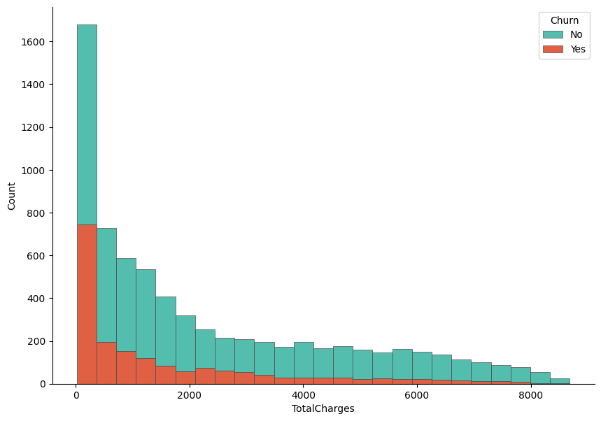
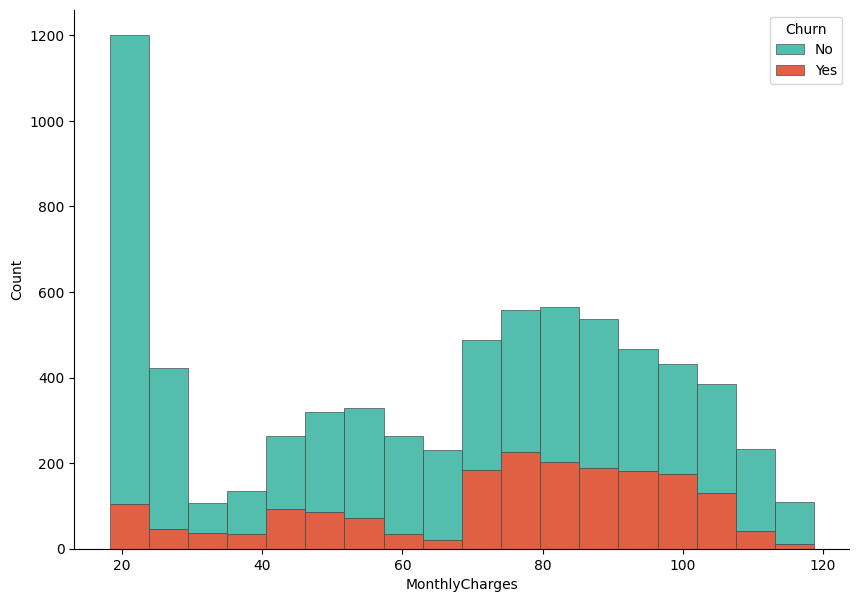
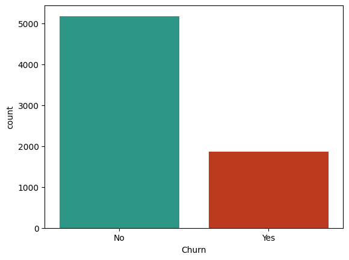
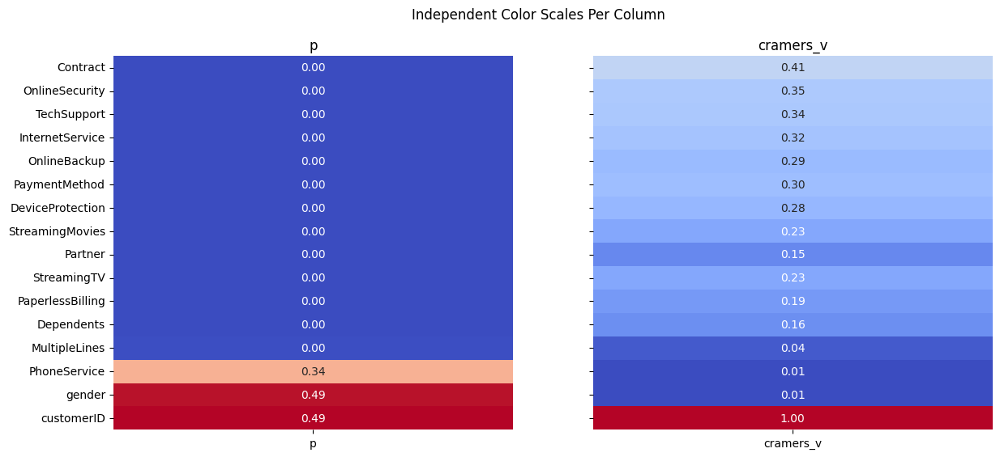
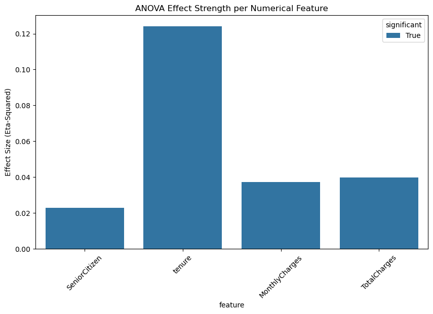
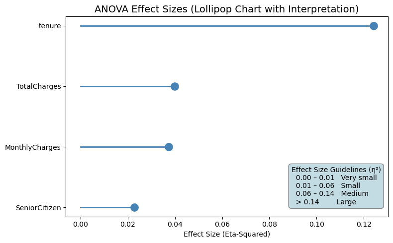

##   Introduction 

In this section, we will perform exploratory data analysis (EDA) on the Telco Customer Churn dataset. EDA is a crucial step in the data science process that helps us understand the underlying structure of the data, identify patterns, and uncover insights that can inform our modeling decisions. We will use various visualization techniques and statistical methods to explore the dataset and gain a deeper understanding of the factors that contribute to customer churn in the telecommunications industry.


## Environment Setup

The first step is initial setup of our environment. We will import the necessary libraries for the analysis, including *pandas* for data manipulation, *numpy* for numerical operations, *matplotlib* and *seaborn* for data visualization.

```python
import pandas as pd
import numpy as np
import matplotlib as mpl
import matplotlib.pyplot as plt
import seaborn as sns
```

Here, we load the Telco Customer Churn dataset from a CSV file using Pandas. The `read_csv` function reads the data into a DataFrame, which is the standard structure used for data analysis in Python. We then create a copy of the original dataset and store it in `df` to preserve the raw data. This is a good practice because it allows us to experiment with cleaning, transformations, and feature engineering without risking accidental changes to the original dataset. Finally, `df.head()` is used to display the first few rows of the dataset, giving an initial overview of the variables, data format, and overall structure.

```python
churn_data = pd.read_csv("/content/drive/MyDrive/Colab Projects/telco_customer_churn/WA_Fn-UseC_-Telco-Customer-Churn.csv")
df = churn_data.copy()
df.head()
```

!!!note
    I use Google Colab Pro for this project, so the dataset is loaded from my Google Drive. You can adjust the file path as needed to load the dataset from your local machine or another source.


We can see the first 3 entries for each column in the dataset, which gives us a glimpse of the data types and the kind of information each column contains. 

<div class="scrollable-table"">


| customerID   | gender   |   SeniorCitizen | Partner   | Dependents   |   tenure | PhoneService   | MultipleLines    | InternetService   | OnlineSecurity   | OnlineBackup   | DeviceProtection   | TechSupport   | StreamingTV   | StreamingMovies   | Contract       | PaperlessBilling   | PaymentMethod             |   MonthlyCharges |   TotalCharges | Churn   |
|:-------------|:---------|----------------:|:----------|:-------------|---------:|:---------------|:-----------------|:------------------|:-----------------|:---------------|:-------------------|:--------------|:--------------|:------------------|:---------------|:-------------------|:--------------------------|-----------------:|---------------:|:--------|
| 7590-VHVEG   | Female   |               0 | Yes       | No           |        1 | No             | No phone service | DSL               | No               | Yes            | No                 | No            | No            | No                | Month-to-month | Yes                | Electronic check          |            29.85 |          29.85 | No      |
| 5575-GNVDE   | Male     |               0 | No        | No           |       34 | Yes            | No               | DSL               | Yes              | No             | Yes                | No            | No            | No                | One year       | No                 | Mailed check              |            56.95 |        1889.5  | No      |
| 3668-QPYBK   | Male     |               0 | No        | No           |        2 | Yes            | No               | DSL               | Yes              | Yes            | No                 | No            | No            | No                | Month-to-month | Yes                | Mailed check              |            53.85 |         108.15 | Yes     |
| 7795-CFOCW   | Male     |               0 | No        | No           |       45 | No             | No phone service | DSL               | Yes              | No             | Yes                | Yes           | No            | No                | One year       | No                 | Bank transfer (automatic) |            42.3  |        1840.75 | No      |
| 9237-HQITU   | Female   |               0 | No        | No           |        2 | Yes            | No               | Fiber optic       | No               | No             | No                 | No            | No            | No                | Month-to-month | Yes                | Electronic check          |            70.7  |         151.65 | Yes     |

</div>


In this step, we remove the `customerID` column from the dataset. This column serves only as a unique identifier for each customer and does not contain any predictive information related to churn. Keeping such identifier variables can introduce noise and is unnecessary for both exploratory analysis and machine learning models. By dropping this column, we ensure that the dataset contains only meaningful features that can contribute to understanding customer behavior and predicting churn.


```python
df = df.drop("customerID", axis = 1)
```

##  Data Wrangling 

At this stage, we use `df.info()` to obtain a concise summary of the dataset. This output provides key information such as the total number of observations, the number of features, data types of each column, and the count of non-null values. It is especially useful for identifying missing values, detecting columns with incorrect data types, and understanding the overall structure of the dataset. This step helps guide subsequent data cleaning and preprocessing decisions.


```python
df.info()
```

**Output:**

```
<class 'pandas.core.frame.DataFrame'>
RangeIndex: 7043 entries, 0 to 7042
Data columns (total 20 columns):
 #   Column            Non-Null Count  Dtype  
---  ------            --------------  -----  
 0   gender            7043 non-null   object 
 1   SeniorCitizen     7043 non-null   int64  
 2   Partner           7043 non-null   object 
 3   Dependents        7043 non-null   object 
 4   tenure            7043 non-null   int64  
 5   PhoneService      7043 non-null   object 
 6   MultipleLines     7043 non-null   object 
 7   InternetService   7043 non-null   object 
 8   OnlineSecurity    7043 non-null   object 
 9   OnlineBackup      7043 non-null   object 
 10  DeviceProtection  7043 non-null   object 
 11  TechSupport       7043 non-null   object 
 12  StreamingTV       7043 non-null   object 
 13  StreamingMovies   7043 non-null   object 
 14  Contract          7043 non-null   object 
 15  PaperlessBilling  7043 non-null   object 
 16  PaymentMethod     7043 non-null   object 
 17  MonthlyCharges    7043 non-null   float64
 18  TotalCharges      7043 non-null   object 
 19  Churn             7043 non-null   object 
dtypes: float64(1), int64(2), object(17)
memory usage: 1.1+ MB
```


The dataset contains 7,043 customer records and 20 variables after removing the customer identifier. Most of the features are categorical in nature, as indicated by 17 columns with `object` data types, which represent customer demographics, service subscriptions, and billing preferences. There are only three numerical variables: `tenure` and `SeniorCitizen` as integers, and `MonthlyCharges` as a continuous numerical feature. Importantly, all columns have 7,043 non-null values, which means there are no missing values at this stage of the analysis. This indicates that the dataset is relatively clean and does not require immediate handling of missing data. However, the presence of numeric information stored as `object` types, such as `TotalCharges`, suggests that further data type conversion will be necessary before modeling. Overall, the structure shows a classification-ready dataset with a mix of categorical and numerical features, suitable for churn prediction after appropriate preprocessing and encoding steps.


Before moving further into the analysis, we need to fix the data type of the `TotalCharges` variable. Although this column represents a numeric monetary value, it is currently stored as an object because some records contain empty strings instead of numbers. These empty entries are first replaced with `NaN` values so they can be properly recognized as missing data. Once the invalid values are handled, the column is converted to a float type. This step ensures that `TotalCharges` can be used reliably in numerical analysis, visualizations, and predictive modeling.


```python
df["TotalCharges"] = df["TotalCharges"].replace(" ", np.nan)
# convert total charges from object to float
df["TotalCharges"] = df["TotalCharges"].astype(float)
```

Next, we check for missing values in the dataset. The `isnull().sum()` command shows the number of null entries in each column, helping us quickly identify which features require further cleaning or special handling before analysis and modeling.


```python
df.isnull().sum()
```

**Output:**


```
gender               0
SeniorCitizen        0
Partner              0
Dependents           0
tenure               0
PhoneService         0
MultipleLines        0
InternetService      0
OnlineSecurity       0
OnlineBackup         0
DeviceProtection     0
TechSupport          0
StreamingTV          0
StreamingMovies      0
Contract             0
PaperlessBilling     0
PaymentMethod        0
MonthlyCharges       0
TotalCharges        11
Churn                0
dtype: int64
```

The results show that the dataset is largely complete, with no missing values in most variables. The only column containing missing data is `TotalCharges`, which has 11 null entries. This confirms that the missing values observed earlier were successfully identified after converting invalid entries to `NaN`. Since the number of missing values is very small compared to the total number of observations, this issue can be handled easily in the next steps without significantly affecting the analysis or model performance.


###  Impute Missing Values

With the following code, we impute the missing values in the `TotalCharges` column using the mean of the existing values. The mean is a common imputation method for numerical data, especially when the number of missing entries is small. By filling in the missing values with the average, we maintain the overall distribution of the `TotalCharges` variable without introducing significant bias. This allows us to proceed with a complete dataset for further analysis and modeling.


```python
df["TotalCharges"] = df["TotalCharges"].fillna(df["TotalCharges"].mean())
df["TotalCharges"].isnull().sum()
```

**Output:**

```
np.int64(0)
```

The output confirms that all missing values in the `TotalCharges` column have been successfully imputed, resulting in zero null entries. The dataset is now complete and ready for further exploratory analysis and modeling steps.


###  Check Duplicate Values

In addition to missing values, it is important to check for duplicate records in the dataset. Duplicate entries can skew analysis and lead to biased model performance if not handled properly. The `duplicated().sum()` function counts the number of duplicate rows in the DataFrame, allowing us to identify whether there are any repeated customer records that need to be addressed before proceeding with further analysis.

```python
df.duplicated().sum()
```

There are 22 duplicate values in the data. Let's remove the duplicates by keeping only one of multiple duplicates.

```python
df = df.drop_duplicates(keep="first")
``` 

After removing duplicates, we can verify that the dataset now contains only unique records, ensuring that our analysis and modeling will not be biased by repeated entries. This step is crucial for maintaining the integrity of our insights and the performance of our predictive models.

```python
df.duplicated().sum()
```

**Output:**

```
np.int64(0)
```

##  Data Insights with Visualizations 

In this step, we visualize the distribution of `TotalCharges` and examine how it differs between customers who churned and those who did not. A histogram is created using Seaborn, where the values of `TotalCharges` are stacked by the `Churn` variable to allow a direct comparison between the two groups. The stacked format helps highlight how churn is distributed across different spending levels. Matplotlib is used to control the figure size and axis formatting, while `despine` is applied to produce a cleaner and more polished look. This visualization provides an early indication of whether total customer spending is associated with churn behavior.


```python
f, ax = plt.subplots(figsize = (10,7))
sns.despine(f)

sns.histplot(
    df,
    x="TotalCharges", hue="Churn",
    multiple="stack",
    palette=my_palette[::-1],
    edgecolor=".3",
    linewidth=.5
)
ax.xaxis.set_major_formatter(mpl.ticker.ScalarFormatter())
plt.show()
```

**Output:**



Let's now visualize the distribution based on the `MonthlyCharges` variable. Similar to the previous plot, we create a histogram that stacks the values of `MonthlyCharges` by the `Churn` variable. This allows us to compare how monthly spending differs between customers who churned and those who stayed. The visualization can reveal whether higher or lower monthly charges are associated with a greater likelihood of churn, providing insights into customer behavior and potential areas for intervention.

```python
f, ax = plt.subplots(figsize = (10,7))
sns.despine(f)

sns.histplot(
    df,
    x="MonthlyCharges", hue="Churn",
    multiple="stack",
    palette=my_palette[::-1],
    edgecolor=".3",
    linewidth=.5
)
ax.xaxis.set_major_formatter(mpl.ticker.ScalarFormatter())
plt.show()
```



The histogram shows clear differences in spending patterns between churned and non-churned customers. Customers who did not churn are more concentrated in the lower total charge ranges, particularly at the very low end, which likely corresponds to newer customers or those using fewer services. In contrast, churned customers are more visible in the mid to higher total charge ranges, indicating that customers who have accumulated higher overall charges are more likely to leave. This suggests that higher long-term spending does not necessarily guarantee retention and may be associated with dissatisfaction related to pricing, service quality, or contract conditions. Overall, `TotalCharges` appears to carry useful information for distinguishing churn behavior and may be an important feature in the predictive modeling stage.


Now, find the distribution of `Churn` variable in the dataset. This will help us understand the balance of the target variable, which is crucial for modeling decisions.

```python
sns.countplot(x = "Churn", data = df, hue = "Churn", palette=my_palette[::-1])
```

**Output:**



The count plot reveals that the dataset is imbalanced, with a significantly higher number of customers who did not churn (approximately 5,000) compared to those who did churn (approximately 1,500). This imbalance can pose challenges for predictive modeling, as models may become biased towards the majority class (non-churned customers) and perform poorly in identifying the minority class (churned customers). It is important to consider this imbalance when selecting modeling techniques and evaluation metrics, as standard accuracy may not be sufficient to assess model performance. Techniques such as resampling, using different algorithms, or applying appropriate evaluation metrics like precision, recall, or the F1 score may be necessary to effectively address the imbalance in the target variable.


## Feature Selection

In this step, we will apply different statistical tests (`Hypothesis testing`) to identify which features are most strongly associated with the target variable `Churn`.  

Since the `Churn` variable is categorical, we will use the Chi-Square test for categorical features and the ANOVA F-test for numerical features. These tests will help us determine which features have a statistically significant relationship with churn, allowing us to select the most relevant variables for our predictive modeling efforts. By focusing on features that are strongly associated with churn, we can improve model performance and gain deeper insights into the factors driving customer attrition.


### Chi-Square Test for Categorical Features

To perform the Chi-Square test for categorical features, we will use the `chi2_contingency` function from the `scipy.stats` library. This test evaluates whether there is a significant association between each categorical feature and the target variable `Churn`. We will iterate through all categorical features in the dataset, create contingency tables, and calculate the p-values to determine which features are significantly associated with churn. Features with p-values below a certain threshold (commonly 0.05) will be considered statistically significant and potentially important for our predictive modeling.

Firstly, import the necessary library for the Chi-Square test:

```python
from scipy.stats import chi2_contingency
```

Then store the categorical features in the datases in a list:

```python
categorical_columns = df.select_dtypes(include = "object").columns
categorical_columns = categorical_columns[:-1]
```

!!!note 
    We exclude the last column `Churn` from the list of categorical features since it is our target variable and we are interested in testing the association of other features with it.

Next, we will perform the Chi-Square test for each categorical feature against the `Churn` variable and store the results in a DataFrame for easy interpretation.

```python

# dictionary to store chi2 results
chi2_results = {}
def chi2_test(df, categorical_columns):
    for col in categorical_columns:
        # cross tabulation of the feature with the target variable
        cross_tab = pd.crosstab(df["Churn"], df[col])
        # chi2 = chi2 statistic, p = p-value 
        # dof = degrees of freedom, expected = expected frequencies
        chi2, p, dof, expected = chi2_contingency(cross_tab)

        # cramer's v rule
        n = cross_tab.sum().sum()
        min_dim = min(cross_tab.shape) - 1
        cramers_v = np.sqrt((chi2 / n) / min_dim)

        chi2_results[col] = {"chi2": chi2, "p": p, "cramers_v": cramers_v}
    return chi2_results


# store the chi2 results in a dataframe and transpose it for better readability
chi2_results = pd.DataFrame(chi2_test(df, categorical_columns)).T

# round the p-values to 3 decimal places for easier interpretation
chi2_results["p"] = np.round(chi2_results["p"],3)

# drop the chi2 statistic from the results since we are more interested in the p-values and Cramer's V for feature selection
chi2_results = chi2_results.drop("chi2", axis=1)

# sort the results by Cramer's V in descending order and then by p-value in ascending order to prioritize features that are both strongly associated with churn and statistically significant
chi2_results = chi2_results.sort_values(by = "cramers_v", ascending = False).sort_values(by = "p")
```

Finally, we can display the results of the Chi-Square test for all categorical features in a visual format. This will allow us to easily identify which features are significantly associated with churn based on their p-values and the strength of association measured by Cramer's V.



The results of the Chi-square analysis reveal that most categorical variables have a statistically significant relationship with customer churn, as indicated by very small p-values close to zero. Among these, **Contract type** stands out with the highest Cramér’s V value (≈ 0.41), suggesting a strong association with churn. This implies that the length or type of contract plays a major role in whether a customer decides to leave. Variables such as **OnlineSecurity**, **TechSupport**, **InternetService**, and **PaymentMethod** also show moderate to strong associations, indicating that service-related features and billing preferences are important drivers of churn behavior.

On the other hand, variables like **gender** and **PhoneService** have high p-values and extremely low Cramér’s V values, meaning there is no meaningful relationship between these features and churn. This suggests that demographic factors such as gender and basic phone service availability do not significantly influence customer retention in this dataset. Overall, the analysis helps narrow down which categorical features are most informative for predictive modeling, highlighting service quality, contract structure, and add-on services as key churn indicators.


###  ANOVA F-test for Numerical Features 

In this section, we analyze the relationship between numerical features and the target variable `Churn` using one-way ANOVA. The goal is to determine whether the mean values of each numerical variable differ significantly between churned and non-churned customers. For each numerical feature, the data is split into groups based on churn status, and an ANOVA test is performed to evaluate whether these group means are statistically different. In addition to the F-statistic and p-value, the effect size is calculated using eta-squared, which quantifies how much of the variance in each numerical variable can be explained by churn. The results are then organized into a DataFrame, making it easier to compare the statistical significance and practical importance of numerical predictors before moving on to modeling.

Import necessary library for the ANOVA F-test:

```python
from scipy.stats import f_oneway
```

As we did for categorical features, we will write a function to perform the ANOVA F-test for each numerical feature against the `Churn` variable and store the results in a DataFrame.

```python
anova_results = {}
def compute_anova(df, numerical_cols, target_col="Churn"):

    # Extract unique groups
    groups = df[target_col].unique()

    for col in numerical_cols:

        # Build list of values for each churn group
        group_values = [
            df[df[target_col] == g][col].dropna().values
            for g in groups
        ]

        # Skip columns where one or more groups have no data
        if any(len(v) == 0 for v in group_values):
            continue

        # Run ANOVA
        F_stat, p_val = f_oneway(*group_values)

        # Effect Size (Eta-Squared)
        # η² = SSB / SST
        overall_mean = df[col].mean()
        ssb = sum([len(vals) * (vals.mean() - overall_mean) ** 2 for vals in group_values])
        ssw = sum([((vals - vals.mean()) ** 2).sum() for vals in group_values])
        sst = ssb + ssw

        eta_squared = ssb / sst if sst > 0 else np.nan

        # Store results
        anova_results[col] = {
            "F_stat": F_stat,
            "p_value": p_val,
            "eta_squared": eta_squared
        }

    return anova_results
```
Now we can run the ANOVA F-test for the numerical features in our dataset and store the results in a DataFrame for easy interpretation.

```python
numerical_cols = df.select_dtypes(include = "number").columns
anova_results = pd.DataFrame(compute_anova(df, numerical_cols=numerical_cols)).T
```

Firstly, display the ANOVA results sorted by p-value to identify which numerical features are significantly associated with churn.

|   F_stat |      p_value |   eta_squared |
|---------:|-------------:|--------------:|
|  164.041 | 3.83986e-37  |     0.0227676 |
|  997.268 | 7.99906e-205 |     0.124065  |
|  273.464 | 2.70665e-60  |     0.0373867 |
|  291.629 | 4.23384e-64  |     0.0397714 |


The ANOVA results indicate that all numerical variables show statistically significant differences between churned and non-churned customers, as evidenced by extremely small p-values. Among these variables, **tenure** stands out with the highest F-statistic and the largest eta-squared value (≈ 0.12), suggesting that the length of time a customer has stayed with the company has the strongest relationship with churn. This implies that customers with shorter tenure are much more likely to churn compared to long-term customers.

Other numerical features such as **MonthlyCharges** and **TotalCharges** also exhibit significant differences between the two churn groups, although their effect sizes are smaller. This indicates that while pricing and accumulated charges do influence churn behavior, their impact is less pronounced than tenure. The **SeniorCitizen** variable shows a statistically significant but relatively weak effect, suggesting that age category plays a minor role compared to service usage and customer history. Overall, these results highlight tenure as the most important numerical predictor of churn, with financial variables providing additional but secondary explanatory power.

Let's visualize ANOVA results for the numerical features using a bar plot to compare the effect sizes (eta-squared) of each feature in relation to churn.

```python
df_plot = anova_results.copy()
df_plot["feature"] = df_plot.index
df_plot["significant"] = df_plot["p_value"] < 0.05

plt.figure(figsize=(10, 6))
sns.barplot(
    data=df_plot,
    x="feature",
    y="eta_squared",
    hue="significant",
    dodge=False
)

plt.xticks(rotation=45)
plt.ylabel("Effect Size (Eta-Squared)")
plt.title("ANOVA Effect Strength per Numerical Feature")
plt.show()
```



To better communicate the practical importance of the ANOVA results, we visualize the effect sizes using a lollipop chart. First, the ANOVA output is prepared by sorting features according to their eta-squared values, which represent the proportion of variance explained by churn. Each line-and-dot pair shows the magnitude of the effect size for a numerical variable, making comparisons across features more intuitive than a table alone. Statistically significant variables are highlighted in color, while non-significant ones are muted for contrast. Additionally, an interpretation box is embedded directly into the plot to provide clear guidelines for reading eta-squared values, helping the reader quickly understand whether each effect is very small, small, medium, or large. This visualization bridges statistical results with interpretability, making the findings more accessible before moving into predictive modeling.

<details>
<summary>Code for Lollipop Chart Visualization</summary>

```python
df_plot = anova_results.copy()
df_plot["feature"] = df_plot.index
df_plot = df_plot.sort_values("eta_squared")

plt.figure(figsize=(8, 5))

# Plot the lollipops
for i, row in df_plot.iterrows():
    color = "steelblue" if row["p_value"] < 0.05 else "gray"
    plt.plot([0, row["eta_squared"]], [i, i], color=color, linewidth=2)
    plt.scatter(row["eta_squared"], i, color=color, s=120)

plt.yticks(range(len(df_plot)), df_plot["feature"])
plt.xlabel("Effect Size (Eta-Squared)")
plt.title("ANOVA Effect Sizes (Lollipop Chart with Interpretation)", fontsize=14)


# Add eta-squared interpretation box INSIDE the plot
interpretation_text = (
    "Effect Size Guidelines (η²)\n"
    "  0.00 – 0.01   Very small\n"
    "  0.01 – 0.06   Small\n"
    "  0.06 – 0.14   Medium\n"
    "  > 0.14        Large"
)

# Coordinates: (x, y) are in axes fraction (0–1)
plt.gca().text(
    0.70, 0.25, interpretation_text,
    transform=plt.gca().transAxes,
    fontsize=10,
    verticalalignment="top",
    bbox=dict(
        boxstyle="round,pad=0.4",
        facecolor="#c3dbe3",
        edgecolor="gray",
        linewidth=1
    )
)

plt.tight_layout()
plt.show()
```

</details>

**Results:**



The lollipop chart clearly highlights the relative importance of numerical features in explaining customer churn. **Tenure** stands out as the most influential variable, with an eta-squared value in the medium effect range, indicating that a meaningful portion of churn variability is explained by how long a customer has been with the company. This reinforces the idea that newer customers are significantly more prone to churn compared to long-term subscribers.

**TotalCharges** and **MonthlyCharges** show small but noticeable effect sizes, suggesting that pricing and accumulated spending contribute to churn behavior, although their impact is weaker than tenure. These variables still provide useful information, especially when combined with other features in a predictive model. **SeniorCitizen** has a very small effect size, indicating that age category alone explains only a minimal portion of churn variation. Overall, the visualization confirms that tenure is the strongest numerical driver of churn, while financial variables play a secondary, supportive role in understanding customer behavior.


## Prepare Data for Modeling 

### Encode Categorical Variables 

At this stage, we prepare the dataset for machine learning by transforming categorical variables into a numerical format. Since most predictive models cannot work directly with categorical text values, a custom one-hot encoding function is defined to handle this transformation in a clean and reusable way.

First, a copy of the original DataFrame is created to avoid modifying the source data. The function then applies one-hot encoding to the selected categorical columns using `pd.get_dummies`. Each category is converted into a binary indicator variable, where a value of 1 represents the presence of that category and 0 represents its absence. The option `drop_first=True` is used to remove one category from each encoded feature, which helps prevent multicollinearity (the dummy variable trap) in linear models. Setting `dtype=int` ensures that the newly created features are stored as numeric values.

After encoding, the original categorical columns are removed from the dataset and replaced with their encoded counterparts by concatenating the transformed features back to the DataFrame. This results in a fully numeric feature matrix while preserving all relevant information from the original categorical variables.

Finally, the target variable `Churn` is converted from categorical labels (“Yes” and “No”) into binary values, where 1 represents churn and 0 represents non-churn. This transformation is essential for supervised learning algorithms, as it defines the prediction target in a numeric format. At the end of this step, the dataset is fully encoded and ready for feature scaling, model training, and evaluation.


```python
def one_hot_encode(df, categorical_cols):

    df_copy = df.copy()

    # One-hot encoding with drop_first=True
    encoded = pd.get_dummies(df_copy[categorical_cols], drop_first=True, dtype=int)

    # Drop original categorical columns
    df_copy = df_copy.drop(columns=categorical_cols)

    # Merge encoded columns
    df_encoded = pd.concat([df_copy, encoded], axis=1)

    return df_encoded

categorical_columns = df.select_dtypes(include = "object").columns[:-1]
df_encoded = one_hot_encode(df, categorical_columns)
```
Since the `Churn` variable is our target, we need to convert it from categorical labels to binary values. This is done by mapping “Yes” to 1 and “No” to 0, which allows us to use it as a numeric target variable for machine learning models.

```python
df_encoded["Churn"] = df_encoded["Churn"].map({"Yes": 1, "No": 0})
```


### Scale Numerical Variables

Before training machine learning models, we standardize the numerical features so they are on a comparable scale. First, the numerical columns are identified from the dataset, excluding the target variable to ensure that only input features are transformed. This separation is important because the target variable should never be scaled or altered during preprocessing.

A scaling function is then defined using `StandardScaler`, which standardizes each numerical feature by subtracting its mean and dividing by its standard deviation. As a result, each transformed feature has a mean close to zero and a standard deviation of one. This step is especially important for algorithms that are sensitive to feature magnitude, such as logistic regression, support vector machines, and distance-based models, where unscaled features can dominate the learning process.

The function operates on a copy of the encoded dataset to preserve the original version. The scaled values replace the original numerical columns, while all encoded categorical features remain unchanged. By applying this transformation, the dataset becomes more suitable for efficient and stable model training. At the end of this step, `df_scaled` contains a fully numeric and standardized feature set, ready to be split into training and testing data for predictive modeling.


```python
def scale_numeric(df_encoded, numeric_cols):

    df_copy = df_encoded.copy()

    scaler = StandardScaler()
    scaled_values = scaler.fit_transform(df_copy[numeric_cols])

    # Replace original columns with scaled values
    df_copy[numeric_cols] = scaled_values

    return df_copy

numerical_cols = df.select_dtypes(include = "number").columns[1:]
df_scaled = scale_numeric(df_encoded, numerical_cols)
```

This will return a DataFrame where all numerical features are standardized, and the target variable `Churn` is encoded as binary values. The dataset is now fully prepared for machine learning modeling, with all features in a numeric format and on a comparable scale.
 
The final dataset `df_scaled` contains the following columns:


<div  class = "scrollable-table">


|   SeniorCitizen |     tenure |   MonthlyCharges |   TotalCharges |   Churn |   gender_Male |   Partner_Yes |   Dependents_Yes |   PhoneService_Yes |   MultipleLines_No phone service |   MultipleLines_Yes |   InternetService_Fiber optic |   InternetService_No |   OnlineSecurity_No internet service |   OnlineSecurity_Yes |   OnlineBackup_No internet service |   OnlineBackup_Yes |   DeviceProtection_No internet service |   DeviceProtection_Yes |   TechSupport_No internet service |   TechSupport_Yes |   StreamingTV_No internet service |   StreamingTV_Yes |   StreamingMovies_No internet service |   StreamingMovies_Yes |   Contract_One year |   Contract_Two year |   PaperlessBilling_Yes |   PaymentMethod_Credit card (automatic) |   PaymentMethod_Electronic check |   PaymentMethod_Mailed check |
|----------------:|-----------:|-----------------:|---------------:|--------:|--------------:|--------------:|-----------------:|-------------------:|---------------------------------:|--------------------:|------------------------------:|---------------------:|-------------------------------------:|---------------------:|-----------------------------------:|-------------------:|---------------------------------------:|-----------------------:|----------------------------------:|------------------:|----------------------------------:|------------------:|--------------------------------------:|----------------------:|--------------------:|--------------------:|-----------------------:|----------------------------------------:|---------------------------------:|-----------------------------:|
|               0 | -1.27744   |        -1.16032  |      -0.994971 |       0 |             0 |             1 |                0 |                  0 |                                1 |                   0 |                             0 |                    0 |                                    0 |                    0 |                                  0 |                  1 |                                      0 |                      0 |                                 0 |                 0 |                                 0 |                 0 |                                     0 |                     0 |                   0 |                   0 |                      1 |                                       0 |                                1 |                            0 |
|               0 |  0.0663274 |        -0.259629 |      -0.173876 |       0 |             1 |             0 |                0 |                  1 |                                0 |                   0 |                             0 |                    0 |                                    0 |                    1 |                                  0 |                  0 |                                      0 |                      1 |                                 0 |                 0 |                                 0 |                 0 |                                     0 |                     0 |                   1 |                   0 |                      0 |                                       0 |                                0 |                            1 |
|               0 | -1.23672   |        -0.36266  |      -0.960399 |       1 |             1 |             0 |                0 |                  1 |                                0 |                   0 |                             0 |                    0 |                                    0 |                    1 |                                  0 |                  1 |                                      0 |                      0 |                                 0 |                 0 |                                 0 |                 0 |                                     0 |                     0 |                   0 |                   0 |                      1 |                                       0 |                                0 |                            1 |
|               0 |  0.514251  |        -0.746535 |      -0.1954   |       0 |             1 |             0 |                0 |                  0 |                                1 |                   0 |                             0 |                    0 |                                    0 |                    1 |                                  0 |                  0 |                                      0 |                      1 |                                 0 |                 1 |                                 0 |                 0 |                                     0 |                     0 |                   1 |                   0 |                      0 |                                       0 |                                0 |                            0 |
|               0 | -1.23672   |         0.197365 |      -0.941193 |       1 |             0 |             0 |                0 |                  1 |                                0 |                   0 |                             1 |                    0 |                                    0 |                    0 |                                  0 |                  0 |                                      0 |                      0 |                                 0 |                 0 |                                 0 |                 0 |                                     0 |                     0 |                   0 |                   0 |                      1 |                                       0 |                                1 |                            0 |

</div>

This dataset is now fully numeric, with all categorical variables encoded and numerical features standardized. The target variable `Churn` is represented as binary values, making it suitable for training machine learning models to predict customer churn.


It has `7043 x 31` shape, which means there are 7043 observations (customers) and 31 features (including the target variable `Churn`). The dataset is now ready for the next steps in the machine learning pipeline, such as splitting into training and testing sets, model selection, and evaluation.

Let's export the dataset to a CSV file for use in the modeling stage.

```python
df_scaled.to_csv("telco_churn_preprocessed.csv", index=False)
```

## Conclusion 

In this step we performed data cleaning and preprocessing to prepare the dataset for machine learning modeling. We identified and imputed missing values in the `TotalCharges` column, ensuring that our dataset is complete and ready for analysis. We also checked for and removed duplicate records to maintain data integrity. Through visualizations, we explored the distribution of key numerical features like `TotalCharges` and `MonthlyCharges`, revealing differences between churned and non-churned customers. The count plot highlighted the imbalance in the target variable `Churn`, which will be important to consider during modeling.

In the next section, we will apply Machine Learning algorithms to predict customer churn based on the preprocessed dataset. We will evaluate model performance using appropriate metrics and techniques to ensure that our predictions are accurate and actionable for business decision-making.


