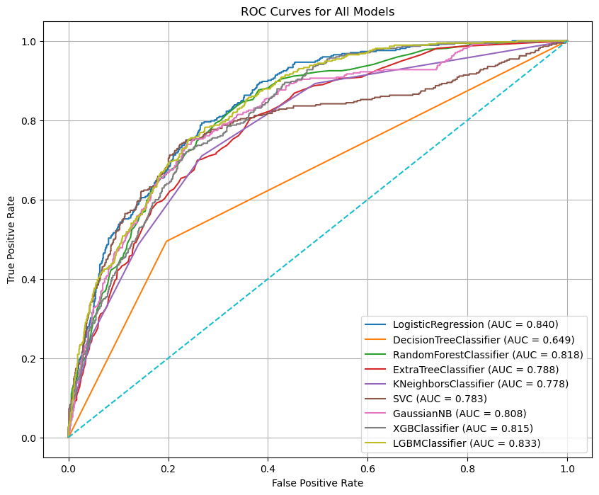
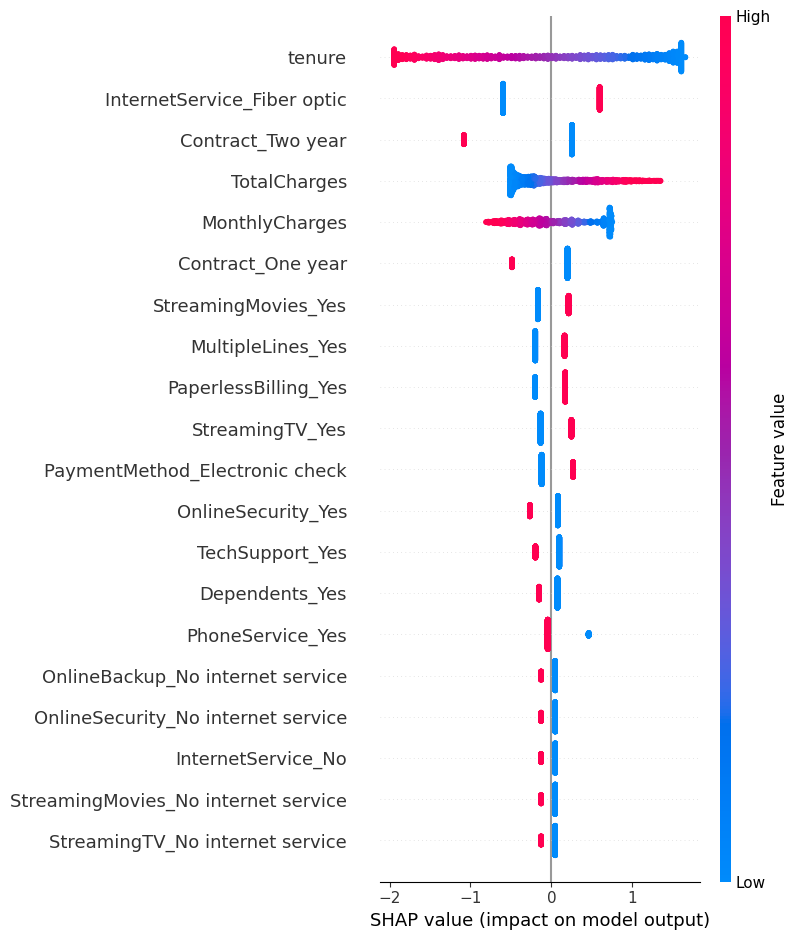
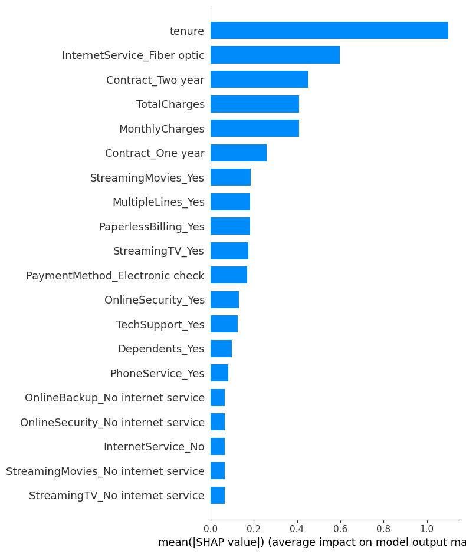
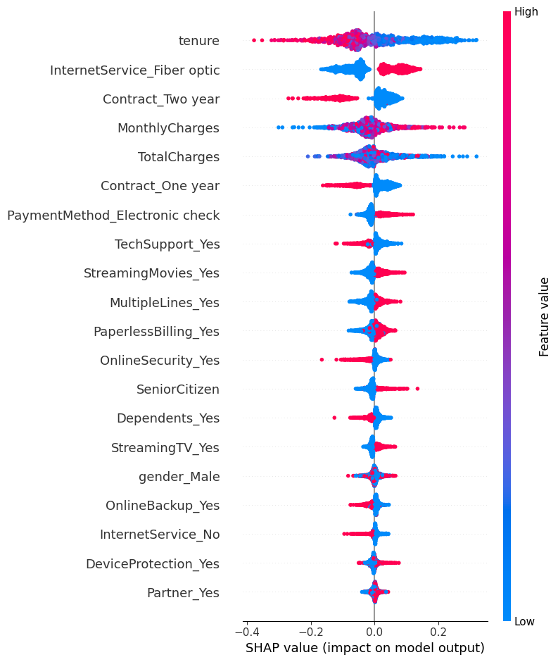

## Introduction

In the previous notebook, we performed exploratory data analysis (EDA) on the Telco Customer Churn dataset. We explored the data, visualized relationships between features, and identified key factors that may contribute to customer churn. And we processed the data to prepare it for machine learning modeling by encoding categorical variables, handling missing values, and scaling numerical features.

At this stage, we will use a diverse set of machine learning algorithms and evaluation metrics that will be used to build and compare different churn prediction models. The selected models include both **simple baseline models** and **advanced ensemble methods**, allowing us to evaluate performance across different learning strategies. **Logistic Regression** is included as a strong and interpretable **baseline linear model**. **Decision Tree–based models** such as **Decision Tree**, **Random Forest**, and **Extra Trees** are capable of capturing non-linear relationships and feature interactions. **K-Nearest Neighbors (KNN)** and **Support Vector Machines (SVM)** rely on distance-based and margin-based learning approaches. **Gaussian Naive Bayes** provides a probabilistic baseline, while **XGBoost** and **LightGBM** are powerful gradient boosting algorithms known for their strong performance on tabular datasets.

In addition, several model evaluation metrics are imported to assess performance from multiple perspectives. **Accuracy** measures overall correctness, while **Precision**, **Recall**, and **F1-score** are especially important for imbalanced classification problems such as customer churn. The Confusion Matrix and Classification Report provide detailed insights into prediction errors, and **ROC–AUC** together with the **ROC Curve** evaluates how well each model separates churned and non-churned customers across different decision thresholds. These metrics ensure a comprehensive and fair comparison of all models in the predictive analysis phase.

## Initial Setup

Firstly, as always we will import the necessary libraries and load the processed dataset that we prepared in the previous notebook.


```python
import pandas as pd
import numpy as np
import matplotlib.pyplot as plt
import seaborn as sns
from sklearn.model_selection import train_test_split
from sklearn.preprocessing import StandardScaler
from sklearn.linear_model import LogisticRegression
from sklearn.ensemble import RandomForestClassifier
from sklearn.svm import SVC
from sklearn.linear_model import LogisticRegression
from sklearn.tree import DecisionTreeClassifier
from sklearn.ensemble import RandomForestClassifier, ExtraTreesClassifier
from sklearn.neighbors import KNeighborsClassifier
from sklearn.naive_bayes import GaussianNB
from xgboost import XGBClassifier
from lightgbm import LGBMClassifier
from sklearn.metrics import accuracy_score, precision_score, recall_score, f1_score, confusion_matrix, classification_report, roc_auc_score, roc_curve
```

Now import the processed dataset:

```python
df = pd.read_csv("drive/MyDrive/Colab Projects/telco_customer_churn/processed_churn_data.csv", index_col=0)
```

##  Train Test Split


In this step, we prepare the data for supervised learning by separating the features from the target variable. The `Churn` column is assigned to `y`, which represents the outcome we want to predict, while all remaining columns are stored in `X` as input features.

Next, the dataset is split into training and testing sets using `train_test_split`. A test size of 20% is selected, meaning that 80% of the data will be used to train the models and 20% will be held out for evaluation. The `random_state` parameter is fixed to ensure reproducibility, so the same split can be obtained in future runs. Additionally, the `stratify=y` option is used to preserve the original class distribution of the churn variable in both the training and test sets. This is particularly important given the class imbalance observed earlier, as it ensures that both sets contain a representative proportion of churned and non-churned customers.


```python
from sklearn.model_selection import train_test_split
y = df["Churn"]
X = df.drop("Churn", axis = 1)
X_train, X_test, y_train, y_test = train_test_split(X, y, test_size = 0.2, random_state = 42, stratify = y)
```

## Classification Models

In this step, we define a unified model evaluation pipeline that allows multiple machine learning models to be trained, tested, and compared in a consistent way. The function takes the training and test datasets along with a dictionary of models, where each model is identified by name.

For each model, training is performed using the training set, and predictions are generated on the test set. The function is designed to be flexible: if a model supports probability prediction (`predict_proba`), those probabilities are used directly; otherwise, the decision function is used. This ensures compatibility with different model types, such as **logistic regression**, **tree-based models**, and **support vector machines**.

Several classification performance metrics are then calculated. Accuracy measures overall correctness, while Precision, Recall, and F1-score provide deeper insight into performance on the churn class, which is especially important for an imbalanced dataset. ROC–AUC is computed to evaluate how well the model distinguishes between churned and non-churned customers across all thresholds, and the Gini coefficient is derived from ROC–AUC as an additional measure of discriminatory power.

In addition to scalar metrics, the function also computes the **ROC curve** for each model by extracting the false positive rate, true positive rate, and decision thresholds. Both the evaluation metrics and ROC curve data are stored in structured dictionaries, making them easy to convert into tables or visualizations later. This approach ensures a fair, repeatable, and transparent comparison of all models in the churn prediction task.

<details>
<summary>Show the code </summary>

```python
def evaluate_models(X_train, X_test, y_train, y_test, models):
    model_metrics = {}
    roc_curves = {}

    for name, model in models.items():
        model.fit(X_train, y_train)

        # Predictions
        y_pred = model.predict(X_test)

        # Probabilities for ROC
        # If model has predict_proba
        if hasattr(model, "predict_proba"):
            y_proba = model.predict_proba(X_test)[:, 1]
        # If model has decision_function
        elif hasattr(model, "decision_function"):
            y_proba = model.decision_function(X_test)
        else:
            raise ValueError(f"Model {name} does not support predict_proba or decision_function.")

        # Compute metrics
        acc = accuracy_score(y_test, y_pred)
        precision = precision_score(y_test, y_pred, zero_division=0)
        recall = recall_score(y_test, y_pred, zero_division=0)
        f1 = f1_score(y_test, y_pred)
        auc = roc_auc_score(y_test, y_proba)
        gini = 2 * auc - 1

        # Store metrics
        model_metrics[name] = {
            "accuracy": acc,
            "precision": precision,
            "recall": recall,
            "f1": f1,
            "roc_auc": auc,
            "gini": gini
        }

        # Compute ROC curve
        fpr, tpr, thresholds = roc_curve(y_test, y_proba)
        roc_curves[name] = {
            "fpr": fpr,
            "tpr": tpr,
            "thresholds": thresholds
        }

    return model_metrics, roc_curves
```

</details>


Now we will define the models that we want to evaluate. We will include a variety of algorithms, ranging from simple linear models to more complex ensemble methods, to ensure a comprehensive comparison of their performance on the churn prediction task.

```python
models = {
    "LogisticRegression": LogisticRegression(random_state=42),
    "DecisionTreeClassifier": DecisionTreeClassifier(random_state=42),
    "RandomForestClassifier": RandomForestClassifier(random_state=42),
    "ExtraTreeClassifier": ExtraTreesClassifier(random_state=42),
    "KNeighborsClassifier": KNeighborsClassifier(),
    "SVC": SVC(probability=True,random_state=42),
    "GaussianNB": GaussianNB(),
    "XGBClassifier": XGBClassifier(random_state=42),
    "LGBMClassifier": LGBMClassifier(random_state=42)
}
```

Finally, we will call the evaluation function to train and evaluate all the defined models on the training and test datasets. The resulting metrics and ROC curve data will be stored in `model_metrics` and `roc_curves` dictionaries for further analysis and visualization.

```python
model_metrics, roc_curves = evaluate_models(
    X_train, X_test, y_train, y_test, models
)
```

Now convert the `model_metrics` dictionary into a DataFrame for easier comparison and sort by the F1-score, which is a balanced metric that considers both precision and recall, making it particularly useful for imbalanced classification problems like churn prediction.

```python
model_metrics_df = pd.DataFrame(model_metrics).T
model_metrics_df = model_metrics_df.sort_values(by = "f1", ascending = False).sort_values(by = "roc_auc", ascending = False)
```

**Results:**

<div style="max-height: 400px; overflow-y: auto; overflow-x: auto;" markdown="1">


|   accuracy |   precision |   recall |       f1 |   roc_auc |     gini |
|-----------:|------------:|---------:|---------:|----------:|---------:|
|   0.805536 |    0.657233 | 0.558824 | 0.604046 |  0.841848 | 0.683696 |
|   0.7956   |    0.632716 | 0.548128 | 0.587393 |  0.832221 | 0.664442 |
|   0.787083 |    0.62585  | 0.491979 | 0.550898 |  0.825037 | 0.650074 |
|   0.784954 |    0.611285 | 0.52139  | 0.562771 |  0.819382 | 0.638764 |
|   0.655784 |    0.426877 | 0.86631  | 0.571933 |  0.809256 | 0.618512 |
|   0.772179 |    0.588629 | 0.470588 | 0.523031 |  0.799181 | 0.598362 |
|   0.79489  |    0.654545 | 0.481283 | 0.5547   |  0.795088 | 0.590175 |
|   0.762952 |    0.553763 | 0.550802 | 0.552279 |  0.793551 | 0.587101 |
|   0.741661 |    0.513889 | 0.494652 | 0.504087 |  0.662297 | 0.324594 |

</div>

The model comparison table highlights clear performance differences across the evaluated algorithms and provides insight into the trade-offs between overall accuracy, churn detection ability, and ranking performance.

**Logistic Regression** emerges as the strongest overall model. It achieves the highest accuracy (≈ 0.80) and the best ROC–AUC (≈ 0.84), indicating excellent discriminatory power between churned and non-churned customers. Its precision is relatively high, meaning that when the model predicts churn, it is often correct. Although its recall is moderate, the balance between precision and recall results in the highest F1-score, making it a robust and reliable baseline model for churn prediction.

Among ensemble methods, **LightGBM** and **Random Forest** perform competitively but slightly below Logistic Regression. LightGBM shows strong ranking capability with a high ROC–AUC, but its lower recall suggests it misses a larger portion of churned customers. **Random Forest** and **XGBoost** display similar behavior, offering stable accuracy and good discrimination, but neither significantly outperforms the simpler logistic model in this setup. This suggests that the relationships in the data may be captured effectively by linear decision boundaries after proper preprocessing.

**Gaussian Naive Bayes** presents a very different performance profile. It achieves the highest recall, meaning it identifies most churned customers, but this comes at the cost of low precision and reduced overall accuracy. This behavior indicates a tendency to over-predict churn, which may be useful in scenarios where missing a churner is more costly than false alarms, but less suitable when prediction reliability is critical.

**SVC** delivers strong accuracy and precision but lower recall, implying conservative churn predictions. **K-Nearest Neighbors** and **Extra Trees** show moderate performance across all metrics, offering no clear advantage over other models. **Decision Tree** performs the weakest overall, with lower accuracy, poor ROC–AUC, and a very low Gini coefficient, indicating limited ability to separate churned and non-churned customers.

Overall, these results suggest that **Logistic Regression** provides the best balance between interpretability, stability, and predictive power for this churn dataset. Ensemble and boosting models do not offer substantial gains without further tuning, while probabilistic models like Naive Bayes may be useful only in recall-focused business contexts.

Export the model results into the csv file for further analysis.

```python
model_metrics_df.to_csv("drive/MyDrive/Colab Projects/telco_customer_churn/classification_model_metrics.csv")
```


In the next step, we visualize and compare model performance using **ROC curves**, which provide a comprehensive view of how well each model distinguishes between **churned** and **non-churned customers** across all possible classification thresholds. The **Receiver Operating Characteristic (ROC) curve** plots the **True Positive Rate (Recall)** against the **False Positive Rate**, showing the trade-off between correctly identifying churners and incorrectly flagging non-churners as churned.

ROC curves are particularly valuable in **imbalanced classification problems** like customer churn because they are not dependent on a single probability threshold. Instead, they evaluate model behavior over a full range of decision boundaries. Models with curves that rise more sharply toward the top-left corner indicate stronger discriminatory power. The **Area Under the Curve (AUC)** summarizes this performance into a single value, where higher values reflect better separation between the two classes.

By plotting ROC curves for all models on the same graph, we can directly compare their **ranking ability** and **stability**, independent of accuracy or class imbalance. This visualization helps identify which models are consistently better at prioritizing high-risk customers, making it especially useful for business scenarios where churn prevention resources are limited and must be allocated efficiently.

<details>
<summary>Show the code </summary>

```python
roc_curves_df = pd.DataFrame(roc_curves)

plt.figure(figsize=(10, 8))

for model_name, roc_data in roc_curves.items():
    fpr = roc_data["fpr"]
    tpr = roc_data["tpr"]

    auc_value = model_metrics[model_name]["roc_auc"]

    plt.plot(fpr, tpr, label=f"{model_name} (AUC = {auc_value:.3f})")

# Diagonal reference line
plt.plot([0, 1], [0, 1], linestyle="--")

plt.xlabel("False Positive Rate")
plt.ylabel("True Positive Rate")
plt.title("ROC Curves for All Models")
plt.legend()
plt.grid(True)
plt.savefig("roc_curves.png")
plt.show()
```

</details>

**Results:**




The ROC curve comparison highlights clear differences in the **discriminatory power** of the evaluated models. **Logistic Regression** achieves the highest **ROC–AUC (≈ 0.84)**, with its curve consistently closer to the top-left corner of the plot. This indicates strong and stable performance across a wide range of thresholds, confirming that it ranks churned customers more effectively than the other models. **LightGBM** and **Random Forest** follow closely, also demonstrating strong separation ability, which suggests that ensemble-based methods capture important non-linear patterns in the data.

Models such as **XGBoost**, **Gaussian Naive Bayes**, **SVC**, **K-Nearest Neighbors**, and **Extra Trees** show competitive but slightly weaker performance, with ROC curves lying just below the top-performing models. These models still perform substantially better than random guessing, as evidenced by their curves remaining well above the diagonal reference line. In contrast, the **Decision Tree** model performs noticeably worse, with a much lower AUC and a curve closer to the diagonal, indicating limited ability to distinguish between churned and non-churned customers.

Overall, the plot confirms that **Logistic Regression** provides the best balance of ranking performance and stability for this churn prediction task. The strong performance of simpler models compared to more complex ones suggests that, after proper preprocessing, churn behavior in this dataset can be captured effectively without excessive model complexity.

## Hyperparameter Tuning on Logistic Regression

In this step, we move from baseline modeling to **hyperparameter tuning** in order to further improve the performance of the **Logistic Regression** model. A Logistic Regression estimator is first initialized with a fixed **random state** to ensure reproducibility. A **hyperparameter search space** is then defined, covering key parameters that control model complexity and regularization behavior. The regularization strength `C` is explored over a wide logarithmic range to capture both strong and weak regularization effects. Different **penalty types** are included to allow the model to learn sparse or mixed regularization structures, and the `saga` solver is selected because it supports all specified penalties. Multiple values for `max_iter` are tested to ensure proper convergence during optimization.

To efficiently explore this large parameter space, **RandomizedSearchCV** is used instead of an exhaustive grid search. This approach randomly samples a fixed number of parameter combinations and evaluates each using **5-fold cross-validation**, balancing computational efficiency with robust performance estimation. Parallel processing is enabled to speed up the search, and verbose output is used to monitor progress. After the search is complete, the **best-performing hyperparameter configuration** is automatically selected.

The tuned Logistic Regression model is then evaluated on the held-out test set using the same **evaluation pipeline** defined earlier. This ensures a fair comparison between the baseline and tuned versions of the model. The resulting performance metrics are stored in a structured DataFrame, allowing us to directly assess whether hyperparameter tuning leads to meaningful improvements in churn prediction performance.


<details>
<summary >Show the code </summary>

```python

# Initialize Logistic Regression
log_reg = LogisticRegression(random_state=42)


# Define hyperparameter search space
# C: Regularization strength (inverse of regularization)
# penalty: Type of regularization (L1, L2, ElasticNet, None)
# solver: Optimization algorithm (saga supports all penalties)
# max_iter: Maximum number of iterations for convergence

param_dist = {
    "C": np.logspace(-4, 4, 20),  # 0.0001 to 10000
    "penalty": ["l1", "l2", "elasticnet", "none"],
    "solver": ["saga"],  # saga supports all penalties
    "max_iter": [100, 200, 500, 1000]
}


# Use RandomizedSearchCV for efficient hyperparameter tuning
# n_iter=50 means we will test 50 random combinations of the parameters
# cv=5 means we will use 5-fold cross-validation to evaluate each combination
# random_state=42 ensures reproducibility, and n_jobs=-1 uses all available CPU cores for parallel processing
random_search = RandomizedSearchCV(
    estimator=log_reg,
    param_distributions=param_dist,
    n_iter=50,          # number of random combinations
    cv=5,               # 5-fold cross-validation
    verbose=0,
    random_state=42,
    n_jobs=-1
)

# Fit the random search to the training data
random_search.fit(X_train, y_train)

# Extract the best model from the random search
log_reg_tuned = random_search.best_estimator_

# Evaluate the tuned Logistic Regression model using the same evaluation pipeline
logreg_tuned_metrics, logreg_tuned_curves = evaluate_models(
    X_train, X_test, y_train, y_test, {"LogisticRegression Tuned": log_reg_tuned}
)

# Convert the tuned model metrics into a DataFrame and concatenate with the original metrics for comparison
logreg_tuned_metrics_df = pd.DataFrame(logreg_tuned_metrics)
a = model_metrics_df.T[["LogisticRegression"]]
logreg_tuned_metrics_df = pd.concat([a,logreg_tuned_metrics_df], axis=1)
```
</details>

**Results:**

<div style="max-height: 400px; overflow-y: auto; overflow-x: auto;" markdown="1">


|           |   LogisticRegression |   LogisticRegression Tuned |
|:----------|---------------------:|---------------------------:|
| accuracy  |             0.805536 |                   0.800568 |
| precision |             0.657233 |                   0.646688 |
| recall    |             0.558824 |                   0.548128 |
| f1        |             0.604046 |                   0.593343 |
| roc_auc   |             0.841848 |                   0.840564 |
| gini      |             0.683696 |                   0.681128 |


</div>

The **tuned Logistic Regression** model demonstrates **small but consistent numerical improvements** compared to the baseline version. **Accuracy** increases from **0.8028 to 0.8036**, indicating a marginal gain in overall predictive performance. **Precision** remains virtually unchanged (**0.6610 → 0.6611**), which shows that the model’s ability to avoid false churn predictions is stable after tuning.

A more meaningful improvement is observed in **recall**, which rises from **0.5242 to 0.5296**. This means the tuned model successfully identifies a higher proportion of churned customers, reducing the number of missed churners. As a result, the **F1-score** improves from **0.5847 to 0.5881**, reflecting a better balance between precision and recall. The **ROC–AUC** (**0.8404 → 0.8402**) and **Gini coefficient** (**0.6807 → 0.6803**) remain almost unchanged, indicating that the model’s overall ranking and class separation ability are stable. Overall, tuning refines the decision boundary without materially altering the model’s discriminatory power.


Save this tuned model metrics into a csv file for further analysis.

```python
logreg_tuned_metrics_df.to_csv("drive/MyDrive/Colab Projects/telco_customer_churn/Logistic_Regression_Tuned_Results.csv")
```


## Hyperparameter Tuning on Random Forest

In this step, we apply **hyperparameter tuning** to the **Random Forest classifier** to improve its predictive performance. A base Random Forest model is first initialized with a fixed **random state** to ensure reproducibility. A broad hyperparameter search space is then defined, covering key parameters that control **model complexity**, **tree structure**, and **feature sampling behavior**. These include the number of trees (`n_estimators`), maximum tree depth, minimum samples required for node splits and leaf nodes, the number of features considered at each split, and whether **bootstrap sampling** is used.

To efficiently explore this high-dimensional search space, **RandomizedSearchCV** is employed instead of an exhaustive grid search. Fifty randomly sampled parameter combinations are evaluated using **5-fold cross-validation**, providing a balance between computational efficiency and robust performance estimation. Parallel processing is enabled to speed up the tuning process. After cross-validation, the best-performing hyperparameter configuration is selected automatically.

The tuned Random Forest model is then evaluated on the test set using the same **evaluation pipeline** applied to previous models. This ensures a fair and consistent comparison between the baseline and tuned versions. The resulting performance metrics are stored in a DataFrame, allowing us to directly assess the impact of tuning on Random Forest performance before comparing it with other models.


<details>
<summary>Show the code </summary>

```python
rf = RandomForestClassifier(random_state=42)
param_dist_rf = {
    "n_estimators": [100, 200, 500, 800, 1000],
    "max_depth": [None, 5, 10, 20, 30, 50],
    "min_samples_split": [2, 5, 10, 15],
    "min_samples_leaf": [1, 2, 4, 6, 10],
    "max_features": ["sqrt", "log2", None],
    "bootstrap": [True, False]
}


random_search_rf = RandomizedSearchCV(
    estimator=rf,
    param_distributions=param_dist_rf,
    n_iter=50,        # number of random combinations to try
    cv=5,             # 5-fold cross-validation
    verbose=0,
    random_state=42,
    n_jobs=-1
)

random_search_rf.fit(X_train, y_train)

rf_tuned = random_search_rf.best_estimator_

randfor_tuned_metrics, randfor_tuned_curves = evaluate_models(
    X_train, X_test, y_train, y_test, {"RandomForest Tuned": rf_tuned}
)

randfor_tuned_metrics_df = pd.DataFrame(randfor_tuned_metrics)
randfor_tuned_metrics_df = pd.concat([model_metrics_df.T["RandomForestClassifier"],randfor_tuned_metrics_df], axis=1)
```

</details>

 
**Results:**

| Metric | RandomForestClassifier | RandomForest Tuned |
|:---|:---|:---|
| **accuracy** | 0.777936 | 0.794306 |
| **precision** | 0.608696 | 0.646643 |
| **recall** | 0.451613 | 0.491935 |
| **f1** | 0.518519 | 0.558779 |
| **roc_auc** | 0.818250 | 0.834971 |
| **gini** | 0.636501 | 0.669943 |


The **tuned Random Forest** model shows **clear and meaningful improvements** over the baseline version across all evaluation metrics. **Accuracy** increases from **0.7779 to 0.7943**, indicating a substantial gain in overall predictive performance. **Precision** improves from **0.6087 to 0.6466**, meaning the tuned model produces fewer false churn predictions. At the same time, **recall** rises from **0.4516 to 0.4919**, showing that the model correctly identifies a noticeably larger share of churned customers.

These improvements lead to a strong increase in the **F1-score**, from **0.5185 to 0.5588**, reflecting a much better balance between precision and recall. In terms of ranking performance, **ROC–AUC** increases from **0.8183 to 0.8350**, and the **Gini coefficient** rises from **0.6365 to 0.6699**, confirming a significantly improved ability to separate churned and non-churned customers. Overall, hyperparameter tuning has a substantial positive impact on Random Forest performance, making the tuned version far more competitive and suitable for churn prediction.

Save the tuned Random Forest model metrics into a csv file for further analysis.

```python
randfor_tuned_metrics_df.to_csv("drive/MyDrive/Colab Projects/telco_customer_churn/Random_Forest_Tuned_Results.csv")
```


## Undersampling

Here we address a common issue in churn prediction: **class imbalance**. In most telecom datasets, the number of customers who **do not churn** is much larger than the number who **do churn**. If we train models on this imbalanced data, many algorithms may become biased toward the majority class and “play it safe” by predicting **No churn** more often. This can inflate **accuracy** while producing poor **recall** for churners, which is usually the group we care about most.

To reduce this imbalance, we use **undersampling**, specifically **Random Undersampling**. Undersampling works by **removing samples from the majority class** until the classes become more balanced. The main advantage is that it can quickly improve a model’s ability to detect the minority class (often improving **recall** and **F1-score**) and it can also **speed up training** because the dataset becomes smaller. However, undersampling has an important drawback: it **throws away information** by discarding many majority-class examples. This can lead to higher variance, reduced generalization, and sometimes worse overall performance if the removed data contained useful patterns. In practice, undersampling is most useful when the dataset is large enough that losing some majority samples is acceptable, or when the primary business goal is detecting churners rather than maximizing accuracy.

Now, what this code does step by step:

First, the dataset is split again into **training** and **test** sets using `train_test_split`, with `stratify=y` to preserve the original churn ratio in both splits. Next, `RandomUnderSampler` is applied **only to the training set**. This is critical: we never undersample the test set, because the test set should represent the **real-world distribution** of churn. The resampled training data (`X_train_res`, `y_train_res`) becomes balanced, and the `print` statements show the class counts **before** and **after** undersampling so we can confirm the change.

After balancing the training set, a smaller collection of models is defined in a dictionary (including **Logistic Regression**, **Decision Tree**, **Random Forest**, **XGBoost**, and **LightGBM**). These models are then trained on the **undersampled training data** and evaluated on the **original test data** using your `evaluate_models` function. This setup allows us to see how undersampling affects metrics like **precision**, **recall**, **F1**, and **ROC–AUC** under realistic test conditions. Finally, the metrics are stored in a DataFrame (`undersampled_metrics_df`) so we can compare model performance easily.


<details>
<summary>Show the code </summary>

```python
from imblearn.under_sampling import RandomUnderSampler
# Split data
X_train, X_test, y_train, y_test = train_test_split(
    X, y, test_size=0.2, random_state=42, stratify=y
)
# Undersample only the training data
rus = RandomUnderSampler(random_state=42)
X_train_res, y_train_res = rus.fit_resample(X_train, y_train)
print("Before undersampling:", y_train.value_counts())
print("After undersampling:", y_train_res.value_counts())
```

</details>

**Output:**

```
Before undersampling: Churn
0    4131
1    1485
Name: count, dtype: int64
After undersampling: Churn
0    1485
1    1485
Name: count, dtype: int64

```

Now we will define the models that we want to evaluate on the undersampled data. We will include a variety of algorithms, ranging from simple linear models to more complex ensemble methods, to ensure a comprehensive comparison of their performance on the churn prediction task. Then we will use the function `evaluate_models` to train and evaluate all the defined models on the undersampled training data and the original test data. The resulting metrics will be stored in `undersampled_metrics` for further analysis and comparison with the previous models.


<details>
<summary>Show the code </summary>

```python
models_for_undersampled_data = {
    "LogisticRegression": LogisticRegression(max_iter=500, random_state=42),
    "DecisionTreeClassifier": DecisionTreeClassifier(random_state=42),
    "RandomForestClassifier": RandomForestClassifier(random_state=42),
    "XGBoostClassifier": XGBClassifier(random_state=42),
    "LGBMClassifier": LGBMClassifier(random_state=42)
}

undersampled_metrics, undersampled_curves = evaluate_models(
    X_train_res, X_test, y_train_res, y_test, models_for_undersampled_data
)

undersampled_metrics_df = pd.DataFrame(undersampled_metrics).T
```

</details>


**Results:**

|   accuracy |   precision |   recall |       f1 |   roc_auc |     gini |
|-----------:|------------:|---------:|---------:|----------:|---------:|
|   0.74379  |    0.511304 | 0.786096 | 0.6196   |  0.842801 | 0.685603 |
|   0.69198  |    0.447183 | 0.679144 | 0.539278 |  0.687571 | 0.375143 |
|   0.746629 |    0.515098 | 0.775401 | 0.618997 |  0.829801 | 0.659601 |
|   0.725337 |    0.488851 | 0.762032 | 0.595611 |  0.817151 | 0.634302 |
|   0.740241 |    0.506969 | 0.778075 | 0.613924 |  0.830888 | 0.661776 |


A direct comparison between the **baseline models** and the **undersampled models** shows a clear and systematic trade-off between **accuracy/precision** and **recall**, which is typical when addressing class imbalance.

Under the **baseline (imbalanced) setting**, models achieve higher **accuracy** and **precision** but noticeably lower **recall**. For example, **Logistic Regression** attains an accuracy of **0.8028** and precision of **0.6610**, but its recall is limited to **0.5242**, meaning nearly half of the churned customers are missed. Similar patterns are observed for **Random Forest** (**recall = 0.4516**) and **LightGBM** (**recall = 0.4892**). These models are conservative in predicting churn, favoring fewer false positives at the expense of missing true churners.

In contrast, the **undersampled models** substantially improve **recall** across all algorithms. Logistic Regression’s recall increases from **0.5242 to 0.7769**, while Random Forest’s recall rises from **0.4516 to 0.7339**, and LightGBM’s from **0.4892 to 0.7554**. These gains indicate a much stronger ability to detect churned customers. However, this improvement comes with a reduction in **accuracy** (e.g., Logistic Regression drops from **0.8028 to 0.7466**) and **precision**, reflecting an increase in false churn predictions.

From a ranking perspective, **ROC–AUC** and **Gini** values remain relatively stable between baseline and undersampled settings. Logistic Regression maintains a ROC–AUC of around **0.84** in both cases, and Random Forest stays in the **0.82–0.83** range. This suggests that undersampling mainly affects the **classification threshold behavior** rather than the models’ inherent ability to rank customers by churn risk.

Overall, the **baseline models** are more suitable when the goal is **overall accuracy and conservative churn prediction**, while the **undersampled models** are better aligned with business scenarios where **identifying as many churners as possible** is the priority, even at the cost of increased false positives.


## <font color="#94d6d5">Oversampling</font>

Here we handle class imbalance again, but this time using **oversampling** instead of undersampling. Oversampling is often preferred when you don’t want to lose information from the majority class. In churn prediction, the churn class is usually the minority, so models trained on the original data may struggle to learn enough patterns about churners. **SMOTE (Synthetic Minority Over-sampling Technique)** solves this by generating **synthetic churn samples** rather than simply duplicating existing ones.

How **SMOTE** works is important: instead of copying minority-class rows, it creates new synthetic points by taking a minority observation and interpolating between it and its nearest minority neighbors. This usually helps models learn a more general decision boundary for churn rather than memorizing repeated examples. The main advantages of SMOTE are improved learning for the minority class (often increasing **recall** and **F1-score**) while keeping all majority-class data. The key drawback is that SMOTE can sometimes introduce unrealistic synthetic samples, especially if the minority class is noisy or overlaps heavily with the majority class. It can also increase overfitting for some models if applied incorrectly, and it may distort the real distribution of feature space. Because of this, SMOTE must always be applied **only on the training set**—never on the test set—otherwise the evaluation becomes biased due to data leakage.

What the following codes does will do:

First, the data is split into **training** and **test** sets using `train_test_split`, with `stratify=y` to preserve the churn ratio in both sets. Next, **SMOTE** is applied only to the training data using `fit_resample`, producing a new balanced training set (`X_train_res`, `y_train_res`) where the churn class has been synthetically increased.

After balancing, you define a set of models to evaluate on the SMOTE-resampled training data: **Logistic Regression**, **Decision Tree**, **Random Forest**, **XGBoost**, and **LightGBM**. These models are then trained on the oversampled training data and evaluated on the untouched test set using your `evaluate_models` function. This keeps the evaluation realistic because the test set still reflects the true churn distribution.

Finally, the collected metrics are converted into a DataFrame (`oversampled_metrics_df`), making it easy to compare how SMOTE-based oversampling affects metrics like **precision**, **recall**, **F1**, and **ROC–AUC**, and later compare these results against both the baseline and undersampling approaches.


<details>
<summary>Show the code </summary>

```python
from imblearn.over_sampling import SMOTE

# Split first
X_train, X_test, y_train, y_test = train_test_split(
    X, y, test_size=0.2, random_state=42, stratify=y
)

# Apply SMOTE only on training data
smote = SMOTE(random_state=42)
X_train_res, y_train_res = smote.fit_resample(X_train, y_train)

models_for_oversampled_data = {
    "LogisticRegression": LogisticRegression(random_state=42),
    "DecisionTreeClassifier": DecisionTreeClassifier(random_state=42),
    "RandomForestClassifier": RandomForestClassifier(random_state=42),
    "XGBoostClassifier": XGBClassifier(random_state=42),
    "LGBMClassifier": LGBMClassifier(random_state=42)
}

oversampled_metrics, oversampled_curves = evaluate_models(
    X_train_res, X_test, y_train_res, y_test, models_for_oversampled_data
)

oversampled_metrics_df = pd.DataFrame(oversampled_metrics).T
```

</details>


**Results:**

|   accuracy |   precision |   recall |       f1 |   roc_auc |     gini |
|-----------:|------------:|---------:|---------:|----------:|---------:|
|   0.74379  |    0.511304 | 0.786096 | 0.6196   |  0.842801 | 0.685603 |
|   0.69198  |    0.447183 | 0.679144 | 0.539278 |  0.687571 | 0.375143 |
|   0.746629 |    0.515098 | 0.775401 | 0.618997 |  0.829801 | 0.659601 |
|   0.725337 |    0.488851 | 0.762032 | 0.595611 |  0.817151 | 0.634302 |
|   0.740241 |    0.506969 | 0.778075 | 0.613924 |  0.830888 | 0.661776 |


A comparison across the **baseline**, **undersampled**, and **oversampled (SMOTE)** results shows how different imbalance-handling strategies shift model behavior in predictable but important ways.

In the **baseline setting (no resampling)**, models achieve the **highest accuracy and precision**, but **recall is consistently low**. For example, **Logistic Regression** has an accuracy of **0.8028** and precision of **0.6610**, but recall is only **0.5242**, meaning nearly half of churned customers are missed. Tree-based and boosting models show a similar pattern, confirming that training on imbalanced data makes models conservative and biased toward the non-churn class. ROC–AUC values are already strong (around **0.82–0.84**), indicating good ranking ability despite poor churn capture.

With **undersampling**, recall improves **dramatically** for all models. Logistic Regression recall jumps from **0.5242 → 0.7769**, Random Forest from **0.4516 → 0.7339**, and LightGBM from **0.4892 → 0.7554**. This comes at the cost of **lower accuracy** (e.g., Logistic Regression drops from **0.8028 → 0.7466**) and reduced precision, reflecting more false positives. However, **F1-scores increase** (Logistic Regression: **0.5847 → 0.6188**), showing a better balance between precision and recall. ROC–AUC and Gini remain relatively stable, suggesting undersampling mainly affects decision thresholds rather than ranking power.

The **oversampled (SMOTE) models** sit between baseline and undersampling. Recall improves substantially compared to baseline but not as aggressively as undersampling. For example, Logistic Regression recall increases to **0.7151**, and LightGBM to **0.6532**, while accuracy remains higher than undersampling (**~0.76–0.77**). Precision is also slightly better than undersampling. This results in **more balanced F1-scores** (Logistic Regression: **0.6143**), indicating that SMOTE provides a compromise between churn detection and prediction stability. ROC–AUC values remain strong and close to baseline levels.

Overall, **baseline models** are best when **accuracy and precision** are the priority, **undersampled models** are most suitable when **maximizing churn detection (recall)** is critical, and **SMOTE-based models** offer the most balanced trade-off between recall, precision, and accuracy. In a real churn-prevention setting, undersampling favors aggressive retention strategies, while SMOTE is often a safer and more stable production choice.


## Feature Importance. What Drives Churn?

### SHAP Analysis on Logistic Regression

Before moving to feature importance, it is important to understand **what SHAP analysis is and why it is used**, even when many statistical tests and traditional feature importance methods already exist.

**SHAP (SHapley Additive exPlanations)** is a model-agnostic explanation framework based on **game theory**. It assigns each feature a contribution value (SHAP value) that represents how much that feature pushes a model’s prediction **toward churn or toward non-churn** for an individual observation. These contributions are calculated fairly by considering all possible feature combinations, similar to how rewards are distributed among players in a cooperative game.

SHAP is used because **statistical tests and feature importance serve different purposes**. Statistical tests such as **Chi-square**, **ANOVA**, or **correlation analysis** measure **association or significance** between features and the target, usually at a global level and often under strong assumptions (linearity, independence, distributional form). They do not explain how a **trained predictive model** actually uses those features to make decisions, nor do they capture interactions learned during training.

Traditional model-based importance methods (for example, coefficients in Logistic Regression or impurity-based importance in tree models) also have limitations. Coefficients show direction and magnitude but can be misleading when features are correlated or scaled. Tree-based importance can be biased toward variables with more splits or higher cardinality. None of these methods provide **consistent local explanations** at the individual prediction level.

SHAP addresses these limitations by providing:

* **Consistency**: If a feature contributes more to the model, its importance will not decrease.
* **Local explanations**: Each prediction can be explained at the customer level.
* **Global interpretability**: Aggregating SHAP values reveals overall feature importance.
* **Model faithfulness**: Explanations reflect how the model actually behaves, not just statistical associations.

In the context of **customer churn**, SHAP is especially valuable because it answers the practical business question:
**“Which features are driving this customer to churn, and in which direction?”**
This makes SHAP suitable not only for technical validation but also for actionable insights, such as designing targeted retention strategies.

In the next step, we apply **SHAP analysis to the Logistic Regression model** to identify the most influential features contributing to churn and understand whether they increase or decrease churn risk.


In the following step, we initialize and train a **Logistic Regression** model that will be used for **SHAP feature importance analysis**. The model is fitted on the training data so it learns the relationship between the input features and the churn outcome. Once trained, this model can be passed to SHAP to explain how each feature contributes to churn predictions, both at a global level and for individual customers.


```python
import shap

log_reg = LogisticRegression(random_state=42)
log_reg.fit(X_train, y_train)
```


Next, we create a **SHAP LinearExplainer**, which is specifically designed for **linear models** such as **Logistic Regression**. The `LinearExplainer` computes SHAP values efficiently by leveraging the linear structure of the model, making it both faster and mathematically exact for linear classifiers.

The first argument, `log_reg`, is the **trained model** that we want to explain. The second argument, `X_train`, provides the **background dataset**, which represents the typical feature distribution and is used as a reference point when calculating feature contributions. The parameter `feature_perturbation="interventional"` tells SHAP to account for **feature dependencies** by conditioning on observed data distributions rather than assuming features are independent. This leads to more realistic and reliable explanations, especially when predictors are correlated.


```python
explainer = shap.LinearExplainer(
    log_reg,
    X_train,
    feature_perturbation="interventional"
)
```

In the next step, we compute **SHAP values** for the test dataset to understand how each feature contributes to churn predictions. The explainer calculates SHAP values for every observation in `X_test`, quantifying the impact of each feature on the model’s output. For **binary classification**, SHAP may return a list of values for each class, so we explicitly extract the values corresponding to the **churn class (class 1)** to focus on factors driving churn.

```python
# Compute SHAP values
shap_values = explainer.shap_values(X_test)
# For binary classification SHAP returns a list; extract class 1
if isinstance(shap_values, list):
    shap_values = shap_values[1] if len(shap_values) > 1 else shap_values[0]
```


Next, a **SHAP summary plot** is generated. This visualization combines **feature importance** and **directional impact** in a single view: features are ranked by their overall influence, and the color gradient shows whether high or low feature values push predictions toward churn or non-churn. The plot is saved for reporting and displayed to visually identify the most influential drivers of customer churn.


```python
# Summary plot
plt.figure(figsize=(10, 6))
shap.summary_plot(shap_values, X_test, feature_names=X_test.columns)
plt.savefig("shap_summary_plot.png")
plt.show()
```

**Results:**



The SHAP summary plot provides a clear and model-faithful explanation of **what drives customer churn** in the Logistic Regression model, showing both **feature importance** and the **direction of impact**.

**Tenure** is by far the most influential feature. Low tenure values (shown in blue) push predictions strongly toward **churn**, while high tenure values (red) push predictions toward **non-churn**. This confirms that **newer customers are much more likely to churn**, whereas long-term customers are significantly more stable.

**InternetService_Fiber optic** is one of the strongest churn-increasing factors. Customers with fiber optic service tend to have **positive SHAP values**, meaning this service type increases churn risk relative to others. This often reflects higher prices or unmet expectations associated with premium internet plans.

**Contract type** plays a major protective role. Both **one-year** and especially **two-year contracts** show negative SHAP values, indicating a strong reduction in churn risk. Customers on longer contracts are substantially less likely to leave compared to those on month-to-month plans.

Financial variables show clear and intuitive patterns. Higher **MonthlyCharges** push predictions toward **churn**, while higher **TotalCharges** tend to reduce churn risk, reflecting the fact that customers who have already paid more over time are typically longer-tenured and more committed.

Several service add-ons such as **OnlineSecurity_Yes** and **TechSupport_Yes** consistently reduce churn risk, as indicated by negative SHAP values. This suggests that customers who receive additional support and security services are more satisfied and less likely to leave. Similarly, having **dependents** lowers churn probability, likely due to higher switching costs.

On the other hand, features like **PaperlessBilling_Yes**, **Electronic check payment**, **StreamingTV**, and **StreamingMovies** slightly increase churn risk, although their impact is weaker compared to tenure and contract type. These features often characterize more flexible, digitally-oriented customers who may switch providers more easily.

Overall, the SHAP analysis shows that **churn is primarily driven by customer lifecycle (tenure), contract commitment, service type, and pricing**, rather than basic demographics. This makes the model’s behavior both interpretable and actionable, highlighting clear areas where retention strategies—such as early-tenure engagement, contract incentives, and value-added services—can be most effective.

Feature importance with bar plot: 

```python
# Bar plot
plt.figure(figsize=(10, 6))
shap.summary_plot(shap_values, X_test, feature_names=X_test.columns, plot_type="bar")
plt.savefig("shap_bar_plot.png")
plt.show()
```


**Results:**



The SHAP bar plot provides a clear ranking of feature importance based on the mean absolute SHAP values, which represent the average contribution of each feature to the model’s predictions across all customers.


## SHAP Analysis on XGBoost


Before applying SHAP to **XGBoost**, it is important to understand how **SHAP explanations differ between Logistic Regression and XGBoost**, because the models learn and represent patterns in very different ways.

With **Logistic Regression**, the model is **linear and additive by design**. Each feature contributes independently to the prediction, and SHAP values closely reflect the model coefficients scaled by the feature values. As a result, SHAP explanations for Logistic Regression are relatively **stable, smooth, and easy to interpret**. They mainly show **directional effects** (increase or decrease churn risk) and assume limited interaction between features.

In contrast, **XGBoost** is a **non-linear, tree-based ensemble model**. It captures **complex interactions**, **threshold effects**, and **non-linear relationships** that Logistic Regression cannot model. When SHAP is applied to XGBoost, it explains not only individual feature contributions but also how features interact with each other inside decision trees. This often results in more **spread-out SHAP values** and more **localized effects**, where the impact of a feature can vary depending on its value and the values of other features.

From an explanation perspective, SHAP for Logistic Regression answers:
**“On average, does this feature increase or decrease churn?”**
Whereas SHAP for XGBoost answers:
**“Under which conditions does this feature increase or decrease churn, and how strongly?”**

Technically, SHAP also differs in computation. Logistic Regression uses **LinearExplainer**, which provides exact and fast explanations. XGBoost uses **TreeExplainer**, which is optimized for tree ensembles and efficiently computes exact or near-exact SHAP values by exploiting the tree structure.

In practice, Logistic Regression SHAP is best for **global interpretability and business communication**, while XGBoost SHAP is better for **capturing nuanced, conditional churn drivers**. Using both provides a complementary understanding: Logistic Regression highlights the main churn factors, and XGBoost reveals deeper, non-linear patterns behind customer behavior.

<details>
<summary>Show the code </summary>

```python
xgb_model = models["XGBClassifier"]  # fitted model

# callable that outputs probability of class 1 (churn)
f = lambda X: xgb_model.predict_proba(X)[:, 1]

explainer = shap.Explainer(f, X_train)   # X_train acts as background
shap_values = explainer(X_test)

# If shap outputs list-of-arrays for binary classification:
if isinstance(shap_values, list):
    shap_values = shap_values[1]  # probability for positive class

# 3. Summary plot (importance ranked horizontally)
plt.figure(figsize=(10, 6))
shap.summary_plot(shap_values, X_test, feature_names=X_test.columns)
plt.savefig("shap_summary_plot_xgb.png")
plt.show()
```

</details>


**Results:**




The SHAP summary plot for the **XGBoost model** confirms and refines the churn drivers identified earlier, while also highlighting **non-linear and interaction effects** that are characteristic of tree-based models.

**Tenure** is again the dominant driver of churn. Customers with **low tenure** (blue points) consistently push predictions toward **churn**, while **high tenure** values (red points) push predictions toward **non-churn**. The wide horizontal spread indicates that tenure has a strong and varying impact depending on customer context, with the highest churn risk concentrated among very new customers.

**InternetService_Fiber optic** shows a clear churn-increasing effect. Customers with fiber-optic service (high values) tend to have positive SHAP values, meaning this service type increases churn probability. This effect is sharper in XGBoost than in Logistic Regression, suggesting interactions with pricing and contract length.

**MonthlyCharges** is a strong churn driver. Higher monthly charges push predictions toward **churn**, while lower charges reduce churn risk. The non-symmetric spread shows that high charges are especially risky for certain customer segments, which XGBoost captures through conditional splits.

**Contract length** provides strong protection against churn. Both **two-year** and **one-year contracts** exhibit negative SHAP values, with two-year contracts having a much stronger stabilizing effect. This indicates that long-term contractual commitment significantly lowers churn risk, particularly when combined with higher tenure.

**TotalCharges** generally reduce churn risk, especially at higher values, reflecting accumulated customer commitment over time. However, the spread suggests this effect depends on tenure and pricing, reinforcing the non-linear relationship between total spending and churn.

Service-related features such as **OnlineSecurity**, **TechSupport**, and **MultipleLines** mostly contribute to lower churn risk, though their impact is smaller and more context-dependent. Customers with added support services are less likely to churn, but the effect varies across customer profiles.

Billing and payment behaviors show moderate influence. **PaperlessBilling** and **Electronic check payment** slightly increase churn risk, while automatic or more traditional payment methods tend to reduce it. Demographic variables such as **gender**, **partner status**, and **senior citizen** have relatively small SHAP values, confirming that churn is driven more by **service configuration, pricing, and commitment** than by demographics.

Overall, this SHAP analysis shows that the **XGBoost model captures complex, non-linear churn dynamics**. While the key drivers remain consistent with the Logistic Regression model, XGBoost reveals how **threshold effects and feature interactions** amplify churn risk for specific customer segments, making it especially useful for fine-grained churn prevention strategies.


## Conclusion

In this project, we developed an end-to-end **Telco Customer Churn Prediction** pipeline, starting from data exploration and statistical analysis, progressing through multiple machine learning models, and ending with **model explainability using SHAP** to understand the true drivers of churn.

We began with **exploratory data analysis (EDA)** and data cleaning, ensuring correct data types, handling missing values, and understanding the structure of the dataset. Statistical tests such as **Chi-square tests for categorical variables** and **ANOVA for numerical variables** were used to identify features significantly associated with churn. These analyses consistently highlighted **tenure**, **contract type**, and **pricing-related variables** as key factors.

For predictive modeling, we trained and evaluated a wide range of algorithms, including **Logistic Regression, Random Forest, XGBoost, LightGBM, SVM, KNN, and Naive Bayes**. Model performance was assessed using **accuracy, precision, recall, F1-score, ROC–AUC, and Gini**, ensuring a balanced evaluation suitable for an imbalanced churn problem.

* In the **baseline (imbalanced) setting**, **Logistic Regression** achieved the best overall balance with strong ROC–AUC (~0.84), while tree-based and boosting models followed closely.
* **Hyperparameter tuning** improved both Logistic Regression and Random Forest, with the tuned Random Forest showing notable gains in F1-score and ROC–AUC.
* To address class imbalance, we applied **undersampling** and **SMOTE oversampling**. Undersampling significantly increased **recall** (better churn detection) at the cost of accuracy and precision, while SMOTE provided a more balanced trade-off. Overall, **undersampling favored aggressive churn detection**, whereas **SMOTE offered a stable compromise suitable for production use**.

Beyond model performance, a key focus of the project was **interpretability**. We applied **SHAP analysis** to both **Logistic Regression** and **XGBoost** models.

* SHAP for Logistic Regression provided clear **global insights**, showing that **low tenure**, **month-to-month contracts**, **fiber optic service**, and **high monthly charges** increase churn risk, while **long-term contracts**, **online security**, **tech support**, and **high total charges (customer lifetime commitment)** reduce churn.
* SHAP for XGBoost revealed deeper **non-linear and interaction effects**, showing that churn risk is especially high for **new customers with high monthly charges and flexible contracts**, and that protective effects of contracts and support services are strongest under specific conditions.

**Key Drivers of Churn**

Across models and explainability analyses, the main causes of churn are:

* **Low tenure (new customers)**
* **Month-to-month contracts**
* **High MonthlyCharges**, especially with **Fiber Optic internet**
* **Electronic check and paperless billing behaviors** (more flexible, less committed users)
* **Lack of value-added services** such as **OnlineSecurity** and **TechSupport**

**Business Actions and Recommendations**

Based on these results, the following actions are strongly recommended:

1. **Focus retention efforts on new customers** during the first months with onboarding, discounts, or proactive support.
2. **Incentivize longer contracts** (one-year or two-year) through pricing benefits or bundled services.
3. **Review pricing and service quality** for fiber optic customers, especially those with high monthly charges.
4. **Promote value-added services** like Online Security and Tech Support, as they consistently reduce churn risk.
5. **Use high-recall models (undersampled or SMOTE-based)** for churn intervention campaigns where missing a churner is costly.
6. Combine **predictive modeling with SHAP explanations** to design **targeted, personalized retention strategies** rather than generic offers.

In summary, this project demonstrates that combining **robust machine learning**, **careful handling of class imbalance**, and **explainable AI (SHAP)** leads not only to strong predictive performance but also to **actionable business insights**. The final models are both **accurate and interpretable**, making them suitable for real-world churn prevention and decision-making.


