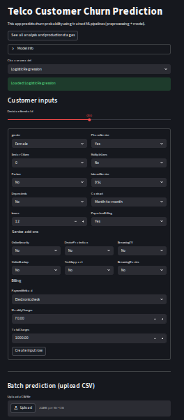

##  Introduction 

In the previous steps, we have developed and evaluated a machine learning model to predict customer churn for the telecommunications company. However, these models are typically developed in a local environment and may not be easily accessible to stakeholders or end-users. They are not designed for real-time predictions or user interaction. We have not used pipelines for model development, which can make it difficult to manage and deploy the model effectively. **Pipeline** is a way to streamline the machine learning workflow by encapsulating all the steps of data preprocessing, feature engineering, and model training into a single object. This allows for easier management of the model and its components, as well as facilitating deployment and scalability.

To address these challenges, in this section, we will re-build our machine learning model using pipelines and deploy it using **Streamlit**, a popular open-source framework for building interactive web applications in Python. Streamlit allows us to create a user-friendly interface where users can input customer data and receive real-time churn predictions based on our trained model.


## Initial Setup and Investigation 

Import the necessary libraries first.

```python
import json
import joblib
import pandas as pd
import streamlit as st
import numpy as np
```


!!!note 
    I run my codes using Google Colab Pro, which provides a cloud-based environment for running Python code. You can also run the code on your local machine if you have the necessary libraries installed. So, I have installed streamlit in my Google Colab environment using the following command:

    ```python
    !pip install streamlit
    ```

Then read the raw dataset. We will use the raw dataset, because in the data cleaning step we have not used column transformers and pipelines, which means that the transformations we applied to the data are not saved in a way that can be easily applied to new data. Therefore, we need to read the raw dataset and apply the same transformations to it before we can use it for predictions.

```python 
data_path = "drive/MyDrive/Colab Projects/telco_customer_churn/WA_Fn-UseC_-Telco-Customer-Churn.csv"
df = pd.read_csv(data_path)
```

Drop `CustomerID` and convert `TotalCharges` to numeric. 

```python
df = df.drop(columns = ["customerID"])
df["TotalCharges"] = pd.to_numeric(df["TotalCharges"], errors = "coerce")

# number of missing values after conversion
print(f"Missing for the TotalCharges after conversion: {df['TotalCharges'].isnull().sum()}")
```

**Output:**

```
Missing for the TotalCharges after conversion: 11
```

There are 11 missing values in the `TotalCharges` column after conversion. We will not impute these missing values yet, because we will be using pipelines to handle the data preprocessing steps, including imputation. We will include an imputation step in our pipeline to handle these missing values when we build our model. This way, we can ensure that the same transformations are applied consistently to both the training data and any new data that we want to make predictions on.

Now check the duplicate values: 

```python
print(f"Duplicate values: {df.duplicated().sum()}")
```

**Output:**

```
Duplicate values: 22
```

Drop the duplicate values in this step, because we will be using pipelines to handle the data preprocessing steps, and we want to ensure that our training data is clean and free of duplicates before we build our model.

```python
df = df.drop_duplicates(keep="first")
```

## Data Preprocessing Automation with ColumnTransformer


As the next step, separate the target as `y` and features as `X`. 

```python
y = df["Churn"].map({"No": 0, "Yes": 1}).astype(int)
X = df.drop(columns=["Churn"])
```

Identify the numeric and categorical features in the dataset. 

```python
# Identify feature types
num_features = X.select_dtypes(include=["int64", "float64"]).columns.tolist()
cat_features = X.select_dtypes(include=["object"]).columns.tolist()

print("Numeric features:")
print(num_features)

print("\nCategorical features:")
print(cat_features)

print("\nCounts - numeric:", len(num_features), "| categorical:", len(cat_features))
```


**Output:**

```
Numeric features:
['SeniorCitizen', 'tenure', 'MonthlyCharges', 'TotalCharges']

Categorical features:
['gender', 'Partner', 'Dependents', 'PhoneService', 'MultipleLines', 'InternetService', 'OnlineSecurity', 'OnlineBackup', 'DeviceProtection', 'TechSupport', 'StreamingTV', 'StreamingMovies', 'Contract', 'PaperlessBilling', 'PaymentMethod']

Counts - numeric: 4 | categorical: 15
```

Now, split the data into `train` and `test`. This process must be done before scaling, encoding or imputation as there may be data leakage. `Stratify` is must here since the churn data is imbalanced.

```python
from sklearn.model_selection import train_test_split

X_train, X_test, y_train, y_test = train_test_split(
    X,
    y,
    test_size=0.2,
    random_state=42,
    stratify=y
)

print("Train shape:", X_train.shape, "| Test shape:", X_test.shape)
print("\nTrain churn rate:\n", y_train.value_counts(normalize=True))
print("\nTest churn rate:\n", y_test.value_counts(normalize=True))
```

**Output:**

```
Train shape: (5616, 19) | Test shape: (1405, 19)

Train churn rate:
 Churn
0    0.735577
1    0.264423
Name: proportion, dtype: float64

Test churn rate:
 Churn
0    0.735231
1    0.264769
Name: proportion, dtype: float64
```

Now build the `preprocessing` steps with `ColumnTransformer` in `sklearn` library. Firstly, import the necessary libraries for building the pipelines.

```python
from sklearn.compose import ColumnTransformer
from sklearn.pipeline import Pipeline
from sklearn.impute import SimpleImputer
from sklearn.preprocessing import OneHotEncoder, StandardScaler
```

For the numeric features we will do two operations: impute missing with median and then scaling. These two options can be done at the same time by simply using sklearn `PipeLine` as following:

```python
# Numeric: impute missing (median) + scale
numeric_transformer = Pipeline(steps=[
    ("imputer", SimpleImputer(strategy="median")),
    ("scaler", StandardScaler())
])
```

For the categorical features, we will do two operations, too: imputing missing values with most-frequent value and then one-hot encoding. Again, use `Pipeline` two combine both.

```python
# Categorical: impute missing (most frequent) + one-hot encode
categorical_transformer = Pipeline(steps=[
    ("imputer", SimpleImputer(strategy="most_frequent")),
    ("onehot", OneHotEncoder(handle_unknown="ignore"))
])
```


Now combine both numeric and categorical transformers into a single `ColumnTransformer` that will apply the appropriate transformations to each type of feature.

```python
preprocessor = ColumnTransformer(
    transformers=[
        ("num", numeric_transformer, num_features),
        ("cat", categorical_transformer, cat_features),
    ],
    remainder="drop"
)
```


## Building the Model with Pipelines

Now we are ready for the model fitting part. Firsttly, we will fit the `Logistic Regression` model with pipeline. 


```python
logreg_pipe = Pipeline(steps=[
    ("preprocess", preprocessor),
    ("model", LogisticRegression(max_iter=2000, random_state=42))
])

logreg_pipe.fit(X_train, y_train)

print("Logistic Regression pipeline fitted.")
```

**Output:**

```
Logistic Regression pipeline fitted.
```

Now, we can predict on the test data and evaluate the results:

```python
# probabilities + predictions
y_proba = logreg_pipe.predict_proba(X_test)[:, 1]
y_pred = (y_proba >= 0.5).astype(int)

# metrics
acc = accuracy_score(y_test, y_pred)
prec = precision_score(y_test, y_pred)
rec = recall_score(y_test, y_pred)
f1 = f1_score(y_test, y_pred)
auc = roc_auc_score(y_test, y_proba)
gini = 2 * auc - 1
cm = confusion_matrix(y_test, y_pred)

print(f"Accuracy : {acc:.4f}")
print(f"Precision: {prec:.4f}")
print(f"Recall   : {rec:.4f}")
print(f"F1-score : {f1:.4f}")
print(f"ROC-AUC  : {auc:.4f}")
print(f"Gini     : {gini:.4f}")
print("\nConfusion Matrix:\n", cm)
```

**Output:**

```
Accuracy : 0.8028
Precision: 0.6610
Recall   : 0.5242
F1-score : 0.5847
ROC-AUC  : 0.8403
Gini     : 0.6805

Confusion Matrix:
 [[933 100]
 [177 195]]
```

This time, we will build XGBoost model with pipeline.

```python
xgb_pipe = Pipeline(steps=[
    ("preprocess", preprocessor),
    ("model", XGBClassifier(
        n_estimators=300,
        max_depth=4,
        learning_rate=0.05,
        subsample=0.8,
        colsample_bytree=0.8,
        objective="binary:logistic",
        eval_metric="auc",
        random_state=42,
        n_jobs=-1
    ))
])

xgb_pipe.fit(X_train, y_train)

print("XGBoost pipeline fitted.")
```

**Output:**

```
XGBoost pipeline fitted.
```


Evaluate the results using fitted XGBoost model.

```python
y_proba_xgb = xgb_pipe.predict_proba(X_test)[:, 1]
y_pred_xgb = (y_proba_xgb >= 0.5).astype(int)

acc = accuracy_score(y_test, y_pred_xgb)
prec = precision_score(y_test, y_pred_xgb)
rec = recall_score(y_test, y_pred_xgb)
f1 = f1_score(y_test, y_pred_xgb)
auc = roc_auc_score(y_test, y_proba_xgb)
gini = 2 * auc - 1
cm = confusion_matrix(y_test, y_pred_xgb)

print(f"Accuracy : {acc:.4f}")
print(f"Precision: {prec:.4f}")
print(f"Recall   : {rec:.4f}")
print(f"F1-score : {f1:.4f}")
print(f"ROC-AUC  : {auc:.4f}")
print(f"Gini     : {gini:.4f}")
print("\nConfusion Matrix:\n", cm)
```

**Output:**

```
Accuracy : 0.7886
Precision: 0.6298
Recall   : 0.4892
F1-score : 0.5507
ROC-AUC  : 0.8386
Gini     : 0.6773

Confusion Matrix:
 [[926 107]
 [190 182]]
```

Finally, store the results (metadata), pipelines and models using `joblib` library.


```python
import json
import joblib

# paths
LOGREG_PATH = "models/logreg_pipeline.joblib"
XGB_PATH = "models/xgb_pipeline.joblib"
META_PATH = "models/metadata.json"

# save pipelines
joblib.dump(logreg_pipe, LOGREG_PATH)
joblib.dump(xgb_pipe, XGB_PATH)

print("Pipelines saved.")

# metadata for Streamlit / deployment
metadata = {
    "dataset": "IBM Telco Customer Churn",
    "rows_after_cleaning": int(X.shape[0]),
    "target": "Churn",
    "target_mapping": {"No": 0, "Yes": 1},
    "numeric_features": num_features,
    "categorical_features": cat_features,
    "expected_columns": X.columns.tolist(),
    "default_threshold": 0.5,
    "models": {
        "logistic_regression": {
            "artifact": LOGREG_PATH,
            "accuracy": 0.8028,
            "precision": 0.6610,
            "recall": 0.5242,
            "f1": 0.5847,
            "roc_auc": 0.8403,
            "gini": 0.6805
        },
        "xgboost": {
            "artifact": XGB_PATH,
            "accuracy": 0.7886,
            "precision": 0.6298,
            "recall": 0.4892,
            "f1": 0.5507,
            "roc_auc": 0.8386,
            "gini": 0.6773
        }
    }
}

with open(META_PATH, "w") as f:
    json.dump(metadata, f, indent=2)

print("Metadata saved.")
```

**Output:**

```
Pipelines saved.
Metadata saved.
```


Now, check how the prediction is automated with pipelines. Take a sample from the test data, feed it to the saved pipelines and get the prediction results.

```python
# load back
logreg_loaded = joblib.load("models/logreg_pipeline.joblib")
xgb_loaded = joblib.load("models/xgb_pipeline.joblib")

# take 1 sample row
sample_X = X_test.iloc[[0]].copy()

# predict
p_logreg = float(logreg_loaded.predict_proba(sample_X)[:, 1][0])
c_logreg = int(p_logreg >= 0.5)

p_xgb = float(xgb_loaded.predict_proba(sample_X)[:, 1][0])
c_xgb = int(p_xgb >= 0.5)

print("Sample input row columns:", sample_X.columns.tolist())
print("\nLogReg -> proba:", round(p_logreg, 4), "| class:", c_logreg)
print("XGB    -> proba:", round(p_xgb, 4), "| class:", c_xgb)
```

**Output:**

```
Sample input row columns: ['gender', 'SeniorCitizen', 'Partner', 'Dependents', 'tenure', 'PhoneService', 'MultipleLines', 'InternetService', 'OnlineSecurity', 'OnlineBackup', 'DeviceProtection', 'TechSupport', 'StreamingTV', 'StreamingMovies', 'Contract', 'PaperlessBilling', 'PaymentMethod', 'MonthlyCharges', 'TotalCharges']

LogReg -> proba: 0.7589 | class: 1
XGB    -> proba: 0.7679 | class: 1
```


##  Deployment to Streamlit 

Till here we could write our codes as a Jupyter notebook. However, to build the Streamlit app, we need to write the code in a Python script format. So, we will create a new Python file named `app.py` and write the Streamlit code there. The code will include loading the saved pipelines and metadata, creating an interactive interface for users to input customer data, and displaying the churn prediction results based on the selected model.


I will write each part of the code separately in order to explain the logic behind it. However, in the actual `app.py` file, all these parts will be combined together to create a complete Streamlit application.


##  Loading Models and Metadata 

In the first part, after importing the necessary libraries, we will set the page configuration for our Streamlit app and load the saved metadata and models using `joblib`. We will use `st.cache_resource` to cache the loaded models and metadata, which will improve the performance of our app by avoiding redundant loading on every interaction.


```python
st.set_page_config(page_title="Telco Churn Prediction", layout="centered")

@st.cache_resource
def load_metadata_and_models():
    # following code will open metada.json file and load the saved pipelines for logistic regression and xgboost models.
    with open("models/metadata.json", "r") as f:
        meta = json.load(f)

    models = {
        "Logistic Regression": joblib.load(meta["models"]["logistic_regression"]["artifact"]),
        "XGBoost": joblib.load(meta["models"]["xgboost"]["artifact"])
    }
    return meta, models

meta, models = load_metadata_and_models()
```

The following code will set the title and description of the Streamlit app, and also provide a link to the GitHub repository where users can see all the analysis and production stages of the project.

```python
st.title("Telco Customer Churn Prediction")
st.write("This app predicts churn probability using trained ML pipelines (preprocessing + model).")
st.link_button(
    "See all analysis and production stages",
    "https://vasif-asadov1.github.io/customer-churn-prediction-pipeline/"
)
```

We can add an expander section to show the metadata information about the dataset and the models used in the project. This will provide users with context about the data and the models that are being used for predictions.

```python
with st.expander("Model info", expanded=False):
    st.write("Dataset:", meta["dataset"])
    st.write("Rows used:", meta["rows_after_cleaning"])
    st.write("Default threshold:", meta["default_threshold"])
```

We can also add a selectbox to allow users to choose which model they want to use for predictions. Once a model is selected, we will load the corresponding pipeline and display a success message indicating that the model has been loaded.

```python
model_name = st.selectbox("Choose a model", list(models.keys()))
model = models[model_name]

st.success(f"Loaded: {model_name}")
```

Then we will create a form where users can input the customer data for prediction. The form will include fields for all the features that are required by the model, and we will use appropriate input types (e.g., selectbox for categorical features, number input for numeric features) to make it user-friendly.

Firstly, we will create a subheader for the customer input section.

```python
st.subheader("Customer inputs")
```

Then, we will create a function for handling Yes/No inputs for categorical features. Also, we will add a slider for adjusting the decision threshold for classification.


```python
expected_cols = meta["expected_columns"]

# helper for Yes/No
def yes_no(label, default="No"):
    return st.selectbox(label, ["No", "Yes"], index=0 if default == "No" else 1)

threshold = st.slider(
    "Decision threshold",
    min_value=0.05,
    max_value=0.95,
    value=float(meta.get("default_threshold", 0.5)),
    step=0.01
)
```


Now we will create input fields for all the features. For numeric features, we will use `st.number_input`, and for categorical features, we will use `st.selectbox` or the `yes_no` helper function we defined earlier. We will embed all these input fields inside a form, so that the user can fill in the data and submit it for prediction.


<details>
<summary>Click to see form structure</summary>

```python
with st.form("churn_form"):
    c1, c2 = st.columns(2)

    with c1:
        gender = st.selectbox("gender", ["Female", "Male"])
        SeniorCitizen = st.selectbox("SeniorCitizen", [0, 1], index=0)
        Partner = yes_no("Partner")
        Dependents = yes_no("Dependents")
        tenure = st.number_input("tenure", min_value=0, max_value=80, value=12, step=1)

    with c2:
        PhoneService = yes_no("PhoneService", default="Yes")
        MultipleLines = st.selectbox("MultipleLines", ["No", "Yes", "No phone service"])
        InternetService = st.selectbox("InternetService", ["DSL", "Fiber optic", "No"])
        Contract = st.selectbox("Contract", ["Month-to-month", "One year", "Two year"])
        PaperlessBilling = yes_no("PaperlessBilling", default="Yes")

    st.markdown("Service add-ons")
    c3, c4, c5 = st.columns(3)

    with c3:
        OnlineSecurity = st.selectbox("OnlineSecurity", ["No", "Yes", "No internet service"])
        OnlineBackup = st.selectbox("OnlineBackup", ["No", "Yes", "No internet service"])

    with c4:
        DeviceProtection = st.selectbox("DeviceProtection", ["No", "Yes", "No internet service"])
        TechSupport = st.selectbox("TechSupport", ["No", "Yes", "No internet service"])

    with c5:
        StreamingTV = st.selectbox("StreamingTV", ["No", "Yes", "No internet service"])
        StreamingMovies = st.selectbox("StreamingMovies", ["No", "Yes", "No internet service"])

    st.markdown("Billing")
    PaymentMethod = st.selectbox(
        "PaymentMethod",
        ["Electronic check", "Mailed check", "Bank transfer (automatic)", "Credit card (automatic)"]
    )

    MonthlyCharges = st.number_input("MonthlyCharges", min_value=0.0, max_value=200.0, value=70.0, step=1.0)
    TotalCharges = st.number_input("TotalCharges", min_value=0.0, max_value=10000.0, value=1000.0, step=10.0)

    submitted = st.form_submit_button("Create input row")

if submitted:
    input_dict = {
        "gender": gender,
        "SeniorCitizen": SeniorCitizen,
        "Partner": Partner,
        "Dependents": Dependents,
        "tenure": tenure,
        "PhoneService": PhoneService,
        "MultipleLines": MultipleLines,
        "InternetService": InternetService,
        "OnlineSecurity": OnlineSecurity,
        "OnlineBackup": OnlineBackup,
        "DeviceProtection": DeviceProtection,
        "TechSupport": TechSupport,
        "StreamingTV": StreamingTV,
        "StreamingMovies": StreamingMovies,
        "Contract": Contract,
        "PaperlessBilling": PaperlessBilling,
        "PaymentMethod": PaymentMethod,
        "MonthlyCharges": MonthlyCharges,
        "TotalCharges": TotalCharges,
    }

    X_input = pd.DataFrame([input_dict])

    # enforce training column order
    X_input = X_input[expected_cols]

    st.write("Input row preview:")
    st.dataframe(X_input, use_container_width=True)

    # Predict
    proba = float(model.predict_proba(X_input)[:, 1][0])
    # threshold = float(meta.get("default_threshold", 0.5))
    pred = int(proba >= threshold)

    st.subheader("Prediction")
    st.metric("Churn probability", f"{proba:.3f}")

    if pred == 1:
        st.error(f"Prediction: CHURN (>= {threshold:.2f})")
    else:
        st.success(f"Prediction: NO CHURN (< {threshold:.2f})")
```
</details>


In the above code, we did the following:

- Created a form with the name "churn_form" to collect user inputs for all the features required by the model.
- Used appropriate input widgets for different types of features (e.g., selectbox for categorical features, number_input for numeric features).
- Added a submit button to the form, which when clicked, will create a dictionary of the input values, convert it into a DataFrame, and ensure that the columns are in the same order as expected by the model.
- Displayed a preview of the input row for the user to verify.
- Used the loaded model pipeline to predict the churn probability based on the user input, and displayed the prediction result along with the probability.

If the user wants to predict the churn probability for a customer, they can simply fill in the form with the customer's data and click the submit button. The app will then process the input through the pipeline (which includes all the necessary preprocessing steps) and provide a prediction on whether the customer is likely to churn or not, along with the associated probability.

However, if the user wants to predict the churn probability for multiple customers at once, they can prepare a CSV file with the same structure as the training data (including all the required features), and then use a file uploader in Streamlit to upload the CSV file. Therefore, we should add a file uploader to the Streamlit app that allows users to upload a CSV file containing multiple customer records for batch prediction. Once the file is uploaded, we can read the CSV file into a DataFrame, apply the same preprocessing steps using the pipeline, and then generate predictions for all the records in the uploaded file. Finally, we can display the predictions in a tabular format within the Streamlit app.

The following code snippet demonstrates how to implement the file uploader for batch predictions in the Streamlit app:

<details>
<summary>Click to see batch prediction code</summary>


```python
st.divider()
st.subheader("Batch prediction (upload CSV)")

uploaded_file = st.file_uploader("Upload a CSV file", type=["csv"])

if uploaded_file is not None:
    df_upload = pd.read_csv(uploaded_file)

    st.write("Uploaded data preview:")
    st.dataframe(df_upload.head(), use_container_width=True)

    # 1) Drop target if present
    if "Churn" in df_upload.columns:
        df_upload = df_upload.drop(columns=["Churn"])

    # 2) Drop customerID if present (training dropped it)
    if "customerID" in df_upload.columns:
        df_upload = df_upload.drop(columns=["customerID"])

    # 3) Convert TotalCharges to numeric if present
    if "TotalCharges" in df_upload.columns:
        df_upload["TotalCharges"] = pd.to_numeric(df_upload["TotalCharges"], errors="coerce")

    # 4) Add missing required columns as NaN (pipeline imputers will handle)
    missing_cols = [c for c in expected_cols if c not in df_upload.columns]
    for c in missing_cols:
        df_upload[c] = np.nan

    # 5) Keep only expected columns, in the correct order
    df_upload = df_upload[expected_cols]

    st.write("Aligned data (ordered like training):")
    st.dataframe(df_upload.head(), use_container_width=True)

    if st.button("Predict for uploaded file", type="primary"):
        proba_batch = model.predict_proba(df_upload)[:, 1]
        pred_batch = (proba_batch >= threshold).astype(int)

        results = df_upload.copy()
        results["churn_probability"] = proba_batch
        results["churn_prediction"] = np.where(pred_batch == 1, "Yes", "No")

        st.success(f"Done. Predicted {len(results)} rows.")
        st.dataframe(results.head(50), use_container_width=True)

        csv_bytes = results.to_csv(index=False).encode("utf-8")
        st.download_button(
            "Download predictions as CSV",
            data=csv_bytes,
            file_name="churn_predictions.csv",
            mime="text/csv"
        )
```
</details>

In the above code we did: 

- Added a file uploader that accepts CSV files.
- When a file is uploaded, we read it into a DataFrame and display a preview.
- We then perform necessary preprocessing steps to align the uploaded data with the expected format (e.g., dropping unnecessary columns, converting data types, adding missing columns).
- After aligning the data, we use the loaded model pipeline to predict churn probabilities and classes for all records in the uploaded file.
- Finally, we display the results in a table and provide an option to download the predictions as a new CSV file.
- This allows users to easily get predictions for multiple customers by simply uploading a CSV file, without needing to input each customer's data manually through the form.
- This batch prediction feature enhances the usability of the Streamlit app, making it more convenient for users who want to analyze larger datasets for churn prediction.


The general looking of the Streamlit app will be as following:



For better experience, you can follow the link to the deployed Streamlit app and try it out yourself: [Streamlit Web Application for Churn Prediction](https://vasif-asadov1-customer-churn-prediction-pipeline-appapp-7qjzk3.streamlit.app/)


##  Conclusion 

We have successfully built a machine learning model for customer churn prediction using pipelines to automate the preprocessing and modeling steps. We then deployed this model using Streamlit, creating an interactive web application that allows users to input customer data and receive real-time churn predictions. The app also supports batch predictions through CSV file uploads, making it convenient for users to analyze larger datasets. By following this structured approach, we have created a comprehensive solution for predicting customer churn in a telecommunications company, which can help the company take proactive measures to retain customers and reduce revenue loss.


